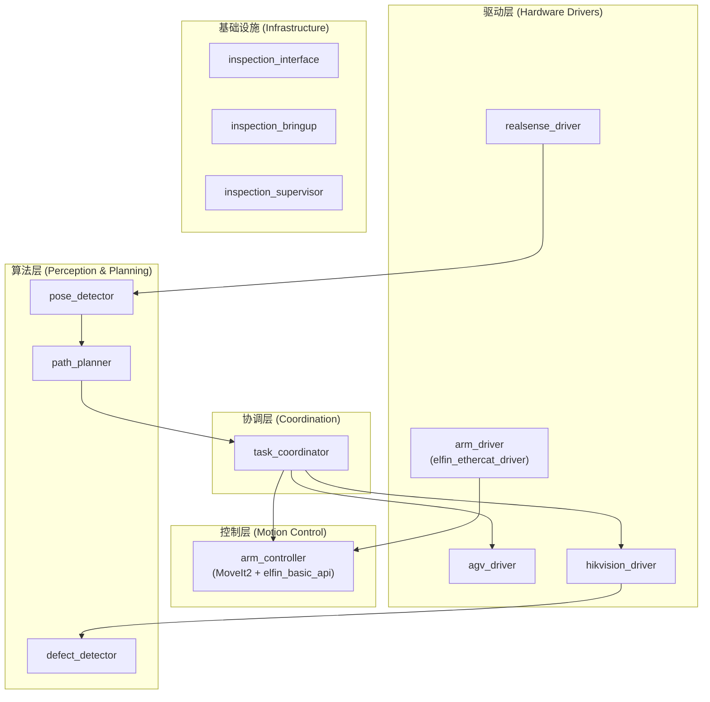

# 基于移动协作机械臂的大型工件视觉检测系统

## 1. 项目背景

在航空制造领域，飞机机翼表面缺陷检测、发动机装配确认等质检任务面临显著挑战。传统固定式AOI设备检测范围有限，无法对大型工件进行全覆盖检测，且设备部署位置固定，难以适应不同检测角度需求。本项目拟开发一套移动式视觉检测系统，通过AGV与协作机械臂的集成，实现大型工件的灵活多角度检测。

## 2. 系统组成

本系统由以下硬件构成：
- 仙宫智能AGV（移动平台，具备SLAM导航）
- 大族E05协作机械臂（6自由度）
- Intel RealSense深度相机（末端安装）
- 海康工业相机（末端安装）

## 3. 环境要求

- **操作系统**: Ubuntu 22.04 (Jammy Jellyfish)
- **ROS版本**: ROS 2 Humble
- **编译器**: GCC 11+ (C++17)
- **Python**: 3.10+

### 依赖库

| 类型 | 依赖 |
|-----|------|
| ROS2 核心 | rclcpp, sensor_msgs, geometry_msgs, nav_msgs, tf2_ros |
| 点云处理 | PCL, Open3D |
| 图像处理 | OpenCV 4.x |
| 深度学习 | ONNX Runtime / TensorRT |
| 数学库 | Eigen3 |

## 4. 技术方案

### 4.1 工件定位

AGV运动至检测起始点后，深度相机对目标工件进行扫描。通过6D位姿估计算法获取工件在相机坐标系下的空间位姿，并将该位姿数据转换至AGV的SLAM全局坐标系，完成工件在地图中的定位注册。

### 4.2 检测点规划

上位机加载待检工件的CAD模型。操作人员在模型上标注待检测区域后，系统基于以下约束自动计算检测路径：
- AGV在SLAM地图中的目标位置
- 机械臂末端的目标位姿
- 相机视野覆盖范围
- 碰撞避免约束

### 4.3 协同执行

系统驱动AGV按规划路径移动至各检测位置。到达后，机械臂调整末端姿态，使工业相机正对检测区域并触发拍摄。采集的图像用于后续缺陷分析。

### 4.4 联合站位与逆解求解（核心方法）

本项目采用“AGV站位 + 机械臂逆解”的联合求解，而不是将两者完全解耦。

#### 4.4.1 差速底盘状态与控制

- 底盘在地图中的状态为 `x, y, yaw`（平面位姿）
- 底盘可直接控制输入为 `v, w`（线速度、角速度）
- 运动学约束：

```math
\dot{x} = v\cos(yaw),\quad
\dot{y} = v\sin(yaw),\quad
\dot{yaw}=w
```

说明：差速底盘不能侧向平移，但 `y` 仍是全局位姿状态量。

#### 4.4.2 联合求解目标

对每个检测点，联合搜索 AGV 目标点位 `b=(x,y,yaw)` 与机械臂关节解 `q`：

```math
\min_{b,q} J=
w_1\|b-b_{prev}\|^2+
w_2\|q-q_{prev}\|^2+
w_3\frac{1}{m(q)+\epsilon}+
w_4E_{view}+
w_5E_{limit}
```

其中：
- `m(q)` 为可操作度（manipulability）
- `E_view` 为相机视角误差
- `E_limit` 为关节逼近限位惩罚

约束条件：
- `q` 必须是目标 TCP 位姿的 IK 可行解
- 关节限位、速度限位满足约束
- AGV 点位可通行
- `MoveJ` 插值路径无碰撞

#### 4.4.3 位姿链计算

1. 由 CAD 标注点和法向构造目标相机位姿 `T_map_cam*`
2. 对每个候选 AGV 点位 `b_i`，计算对应 TCP 目标：

```math
T_{arm\_base}^{tcp}(i)=
\left(T_{map}^{base}(b_i)\,T_{base}^{arm\_base}\right)^{-1}
\,T_{map}^{cam*}\,
\left(T_{tcp}^{cam}\right)^{-1}
```

3. 对 `T_arm_base_tcp(i)` 求逆解（TRAC-IK/IKFast/MoveIt2 IK）
4. 对所有可行 `(b_i, q_i)` 进行代价评估并选最优

#### 4.4.4 AGV 点位给定方式

- AGV 自带 SLAM，ROS2 侧只下发 `map` 坐标系目标位姿（`x,y,yaw`）
- 建议消息类型：`geometry_msgs/PoseStamped`，`frame_id="map"`
- 第一阶段采用“离线站位库 + 在线筛选”：
  - 离线：围绕工件预设一组候选站位
  - 在线：结合当前工件位姿、IK可达性、碰撞与代价函数选择最优站位

#### 4.4.5 执行闭环

```text
for each inspection point:
  1) 计算并选择最优 (agv_goal, arm_goal)
  2) 下发 AGV 到 agv_goal
  3) 等待 arrived=true 且 stopped=true
  4) 机械臂 MoveJ 到 arm_goal
  5) 触发工业相机拍照
  6) 记录检测结果并进入下一点
```

该方法兼顾可实现性与论文创新性：在差速底盘约束下，实现检测质量驱动的“移动底盘-机械臂”联合优化。

## 5. 系统架构



## 6. 功能包设计

### 命名规则

借鉴 radar_ros_ws 的设计思想：

| 层级 | 命名模式 | 示例 |
|-----|---------|------|
| **驱动层** | `[设备]_driver` | `agv_driver`, `arm_driver`, `hikvision_driver` |
| **控制层** | `[设备]_controller` | `arm_controller` |
| **算法层** | `[处理方式]_[目标对象]` | `pose_detector`, `path_planner`, `defect_detector` |
| **基础设施** | `inspection_[功能]` | `inspection_bringup`, `inspection_interface` |

**设计原则**：
- 驱动层统一 `*_driver` 后缀，职责单一，仅硬件通信
- 控制层统一 `*_controller` 后缀，封装运动规划（MoveIt2）
- 算法层强调"做什么"，保持通用性
- 使用 ROS2 Composable Node 架构，支持容器化部署

---

### 6.1 驱动层 (Hardware Drivers)

#### **agv_driver** (AGV底盘驱动)

纯驱动层，封装仙宫AGV SDK，提供ROS接口。

- **功能**:
  - 封装仙宫AGV SDK通信（AGV自带SLAM）
  - 接收 `map` 坐标系目标点并下发到底盘导航
  - 转发AGV当前位姿到ROS（`map -> base_link`）
  - 上报底盘状态（`arrived` / `stopped` / `error_code`）
- **节点**: `agv_driver_node` (Composable)
- **命名空间**: `/inspection/agv`
- **订阅**:
  - `~/goal_pose` (geometry_msgs/PoseStamped) - 导航目标（map系）
  - `~/cmd_vel` (geometry_msgs/Twist) - 手动调试速度指令（可选）
- **发布**:
  - `~/current_pose` (geometry_msgs/PoseStamped) - 当前位姿（map系）
  - `~/status` (AgvStatus) - 底盘状态（到位、静止、电压、错误码）
  - `~/odom` (nav_msgs/Odometry) - 里程计（若SDK提供）
- **TF**: `map → base_link`（由SDK位姿转换发布）

#### **arm_driver** (机械臂驱动)

纯驱动层，封装大族 E05 EtherCAT 通信（基于 elfin_ethercat_driver）。

**内部结构**：
```
arm_driver/
├── elfin_core/              # Elfin SDK 原始包
│   ├── elfin_ethercat_driver/  # EtherCAT 硬件驱动
│   ├── elfin_ros_control/      # ROS2 control 硬件接口
│   ├── elfin_robot_msgs/       # 消息定义
│   └── soem_ros2/              # EtherCAT 协议栈
└── src/
    └── arm_driver_wrapper.cpp  # 统一接口封装
```

- **功能**:
  - 封装 EtherCAT 通信协议
  - 发布关节状态（位置、速度、扭矩）
  - 接收关节指令（位置、速度）
  - 提供使能/禁用、故障清除服务
- **节点**: `arm_driver_node`
- **命名空间**: `/inspection/arm`
- **订阅**:
  - `~/joint_cmd` (sensor_msgs/JointState) - 关节指令
- **发布**:
  - `/joint_states` (sensor_msgs/JointState) - 关节状态
  - `~/status` (ArmStatus) - 机械臂状态
- **Service**:
  - `~/enable` - 使能机械臂
  - `~/disable` - 禁用机械臂
  - `~/clear_fault` - 清除故障
  - `~/stop` - 紧急停止

#### **realsense_driver** (深度相机驱动)

直接使用Intel官方 `realsense2_camera` 包，封装配置。

- **功能**:
  - 发布彩色图像、深度图、点云
- **命名空间**: `/inspection/realsense`
- **发布**:
  - `~/color/image_raw`
  - `~/depth/image_rect_raw`
  - `~/depth/color/points`
  - `~/camera_info`

#### **hikvision_driver** (工业相机驱动)

纯驱动层，封装海康SDK。

- **功能**:
  - 软/硬触发图像采集
  - 曝光、增益参数控制
- **节点**: `hikvision_driver_node` (Composable)
- **命名空间**: `/inspection/hikvision`
- **发布**:
  - `~/image_raw` (sensor_msgs/Image)
  - `~/camera_info` (sensor_msgs/CameraInfo)
- **Service**:
  - `~/trigger` - 触发单帧采集

---

### 6.2 控制层 (Motion Control)

#### **arm_controller** (机械臂运动控制)

高级运动控制接口，基于 MoveIt2 和 elfin_basic_api，提供笛卡尔位姿控制和轨迹规划。

**内部结构**：
```
arm_controller/
├── elfin_core/
│   ├── elfin_basic_api/        # MoveIt2 运动规划封装
│   ├── elfin_description/      # URDF 模型
│   └── elfin5_ros2_moveit2/    # MoveIt2 配置（针对 Elfin5 型号）
└── src/
    └── arm_controller_node.cpp # 对外接口节点
```

- **功能**:
  - 笛卡尔空间位姿控制（末端位置+姿态）
  - 关节空间运动规划
  - 笛卡尔路径规划（线性、圆弧）
  - 碰撞检测和避障
  - 速度缩放控制
- **节点**: `arm_controller_node`
- **命名空间**: `/inspection/arm_control`
- **订阅**:
  - `~/cart_goal` (PoseStamped) - 笛卡尔目标位姿
  - `~/joint_goal` (JointState) - 关节目标位置
  - `~/cart_path_goal` (PoseArray) - 笛卡尔路径
  - `~/velocity_scaling` (Float64) - 速度缩放系数
- **发布**:
  - `~/motion_status` (String) - 运动状态
  - `~/trajectory_progress` (Float64) - 轨迹执行进度
- **Service**:
  - `~/move_to_pose` (MoveToPose) - 移动到目标位姿（阻塞）
  - `~/move_joint` (MoveJoint) - 关节空间运动（阻塞）
  - `~/execute_path` (ExecutePath) - 执行笛卡尔路径
  - `~/set_reference_frame` (SetString) - 设置参考坐标系
  - `~/stop_motion` (Empty) - 停止当前运动
- **参数**:
  ```yaml
  arm_controller:
    ros__parameters:
      robot_model: "elfin5"
      planning_group: "elfin_arm"
      velocity_scaling: 0.5       # 默认速度缩放
      acceleration_scaling: 0.5   # 默认加速度缩放
      planning_time: 5.0          # 规划超时时间(秒)
      goal_tolerance: 0.01        # 目标位置容差(米)
      orientation_tolerance: 0.05 # 目标姿态容差(弧度)
  ```

**依赖关系**：
```
arm_controller
    ↓ (调用)
MoveIt2 运动规划
    ↓ (生成轨迹)
joint_trajectory_controller
    ↓ (通过 ROS2 control)
arm_driver (硬件接口)
```

---

### 6.3 算法层 (Perception & Planning)

#### **pose_detector** (位姿检测)

通用位姿检测模块，可检测任意已知模型的物体。

- **功能**:
  - 基于深度相机的6D位姿检测
  - 点云配准（ICP/FPFH）或深度学习检测
  - 输出目标在SLAM地图中的位姿
- **节点**: `pose_detector_node` (Composable)
- **命名空间**: `/inspection/perception`
- **订阅**:
  - `/inspection/realsense/depth/color/points` (PointCloud2)
- **发布**:
  - `~/detected_pose` (PoseStamped) - 检测到的位姿
  - `~/confidence` (Float32) - 置信度
- **Service**:
  - `~/detect` - 触发检测
- **参数**:
  ```yaml
  pose_detector:
    ros__parameters:
      model_path: "models/workpiece.pcd"
      algorithm: "icp"  # icp | fpfh | deep_learning
      voxel_size: 0.01
      max_correspondence_dist: 0.05
  ```

#### **path_planner** (路径规划)

AGV+机械臂联合路径规划。

- **功能**:
  - 加载CAD模型并接收人工标注检测点
  - 生成候选AGV站位（`x,y,yaw`）
  - 通过位姿链反推TCP目标位姿并求解IK
  - 进行 `MoveJ` 插值路径碰撞检查
  - 基于联合代价函数选择最优 `(agv_pose, arm_joints)`
  - 对检测点序列进行路径排序优化（TSP）
- **节点**: `path_planner_node`
- **命名空间**: `/inspection/planning`
- **订阅**:
  - `/inspection/perception/detected_pose` - 工件位姿
  - `/inspection/agv/current_pose` - 当前底盘位姿
- **发布**:
  - `~/path` (InspectionPath) - 含AGV站位+机械臂目标的检测路径
- **Service**:
  - `~/load_model` - 加载CAD模型
  - `~/add_point` - 添加检测点
  - `~/optimize` - 联合优化并生成路径
- **参数**:
  ```yaml
  path_planner:
    ros__parameters:
      camera_working_dist: 0.3
      arm_reach_max: 0.8
      arm_reach_min: 0.2
      collision_margin: 0.05
      candidate_radius: 0.6
      candidate_yaw_step_deg: 15.0
      w_agv_distance: 1.0
      w_joint_delta: 0.8
      w_manipulability: 0.6
      w_view_error: 1.2
      w_joint_limit: 0.5
  ```

- **核心代价函数**:
  ```math
  J=
  w_1\|b-b_{prev}\|^2+
  w_2\|q-q_{prev}\|^2+
  w_3\frac{1}{m(q)+\epsilon}+
  w_4E_{view}+
  w_5E_{limit}
  ```

#### **defect_detector** (缺陷检测)

图像缺陷检测算法模块。

- **功能**:
  - 图像缺陷检测（传统算法或深度学习）
  - 返回缺陷类型、位置、置信度
- **节点**: `defect_detector_node` (Composable)
- **命名空间**: `/inspection/perception`
- **订阅**:
  - `/inspection/hikvision/image_raw` (Image)
- **发布**:
  - `~/result` (DefectResult) - 检测结果
  - `~/visualization` (Image) - 可视化标注
- **Service**:
  - `~/detect` - 触发检测
- **参数**:
  ```yaml
  defect_detector:
    ros__parameters:
      model_path: "models/defect.onnx"
      confidence_threshold: 0.7
      nms_threshold: 0.5
  ```

---

### 6.4 协调层 (Coordination)

#### **task_coordinator** (任务协调)

系统大脑，负责任务编排和状态机管理。

- **功能**:
  - 任务状态机管理
  - 子系统协调调度
  - 异常处理与恢复
- **节点**: `task_coordinator_node`
- **命名空间**: `/inspection`
- **状态机**:
  ```
  IDLE → LOCALIZING → PLANNING → EXECUTING → COMPLETED
           ↑___________↓__________↓ (出错可重试)
  ```
- **发布**:
  - `/inspection/state` (SystemState) - 系统整体状态
- **调用服务**:
  - 控制层: `~/arm_control/move_joint`（主流程，MoveJ）, `~/arm_control/move_to_pose`（调试）
  - 驱动层: `~/hikvision/trigger`
  - 算法层: `~/perception/detect`, `~/planning/optimize`
- **发布命令**:
  - `/inspection/agv/goal_pose` (PoseStamped) - 发送AGV目标点
- **状态门控**:
  - 仅当 `/inspection/agv/status` 满足 `arrived=true && stopped=true` 时下发机械臂动作

---

### 6.5 基础设施 (Infrastructure)

#### **inspection_interface** (接口定义)

消息、服务、Action 定义包。

```
inspection_interface/
├── msg/
│   ├── AgvStatus.msg
│   ├── ArmStatus.msg
│   ├── InspectionPoint.msg
│   ├── InspectionPath.msg
│   ├── DefectResult.msg
│   └── SystemState.msg
├── srv/
│   ├── DetectPose.srv
│   ├── OptimizePath.srv
│   ├── DetectDefect.srv
│   ├── MoveJoint.srv
│   ├── MoveToPose.srv
│   └── TriggerCapture.srv
└── action/
    └── ExecuteInspection.action
```

#### **inspection_bringup** (启动管理)

集中管理launch文件和配置。

```
inspection_bringup/
├── launch/
│   ├── drivers.launch.py       # 启动所有驱动（容器化）
│   ├── perception.launch.py    # 启动感知算法（容器化）
│   ├── system.launch.py        # 启动完整系统
│   └── rviz.launch.py          # 启动可视化
├── config/
│   ├── drivers.yaml            # 驱动参数
│   ├── perception.yaml         # 感知参数
│   └── inspection.rviz
└── resource/
    ├── models/                 # CAD/点云模型
    └── calibration/            # 标定文件
```

**容器化启动示例** (drivers.launch.py):
```python
from launch_ros.actions import ComposableNodeContainer
from launch_ros.descriptions import ComposableNode

def generate_launch_description():
    container = ComposableNodeContainer(
        name='driver_container',
        namespace='/inspection',
        package='rclcpp_components',
        executable='component_container',
        composable_node_descriptions=[
            ComposableNode(
                package='hikvision_driver',
                plugin='hikvision_driver::HikvisionDriverNode',
                name='hikvision_driver_node',
                namespace='/inspection/hikvision',
            ),
            ComposableNode(
                package='arm_driver',
                plugin='arm_driver::ArmDriverNode',
                name='arm_driver_node',
                namespace='/inspection/arm',
            ),
        ],
    )
    return LaunchDescription([container])
```

#### **inspection_supervisor** (状态监控)

系统健康监控，可选 GUI。

- **功能**:
  - 监控各节点心跳
  - 汇总系统状态
  - 异常告警
- **节点**: `supervisor_node` (Python)
- **发布**:
  - `/inspection/health` - 各节点健康状态
  - `/inspection/alerts` - 异常告警

---

## 7. 工作空间结构

```
inspection_ws/
├── src/
│   │── 基础设施 ──────────────────────────
│   ├── inspection_interface/     # 消息/服务定义
│   ├── inspection_bringup/       # 启动管理
│   ├── inspection_supervisor/    # 状态监控
│   │
│   │── 驱动层 ────────────────────────────
│   ├── agv_driver/               # 仙宫AGV驱动
│   ├── arm_driver/               # 大族机械臂EtherCAT驱动
│   │   ├── elfin_core/           # Elfin SDK原始包
│   │   │   ├── elfin_ethercat_driver/
│   │   │   ├── elfin_ros_control/
│   │   │   ├── elfin_robot_msgs/
│   │   │   └── soem_ros2/
│   │   └── src/
│   │       └── arm_driver_wrapper.cpp
│   ├── realsense_driver/         # RealSense配置封装
│   ├── hikvision_driver/         # 海康工业相机驱动
│   │
│   │── 控制层 ────────────────────────────
│   ├── arm_controller/           # 机械臂运动控制
│   │   ├── elfin_core/           # Elfin SDK原始包
│   │   │   ├── elfin_basic_api/
│   │   │   ├── elfin_description/
│   │   │   └── elfin5_ros2_moveit2/
│   │   └── src/
│   │       └── arm_controller_node.cpp
│   │
│   │── 算法层 ────────────────────────────
│   ├── pose_detector/            # 位姿检测
│   ├── path_planner/             # 路径规划
│   ├── defect_detector/          # 缺陷检测
│   │
│   │── 协调层 ────────────────────────────
│   └── task_coordinator/         # 任务协调
│
├── install/
├── build/
└── log/
```

## 8. 数据流

### 8.1 初始化阶段

```
1. 启动 inspection_bringup 加载所有配置
2. 驱动容器启动，建立硬件连接
3. TF树自动发布
```

### 8.2 工件定位阶段

```
realsense_driver ──→ pose_detector ──→ task_coordinator
    (点云)              (位姿)            (决策)
```

### 8.3 路径规划阶段

```
pose_detector + CAD模型 + agv_current_pose ──→ path_planner ──→ task_coordinator
      (工件位姿)                       (联合优化路径)        (保存路径)

path_planner内部:
  候选AGV站位采样 → 位姿链反推TCP → IK筛选 → MoveJ碰撞检查 → 代价最小化
```

### 8.4 执行阶段（循环）

```
for waypoint in path:
    task_coordinator ──→ agv_driver        (发送 map系 goal_pose)
    wait agv_status.arrived && agv_status.stopped
    task_coordinator ──→ arm_controller    (MoveJ 到 joint_goal)
        arm_controller ──→ MoveIt2/IK      (逆解+轨迹)
        MoveIt2/IK ──→ arm_driver          (执行轨迹)
    task_coordinator ──→ hikvision_driver  (触发拍照)
    hikvision_driver ──→ defect_detector   (图像)
    defect_detector  ──→ task_coordinator  (结果)
```

## 9. 依赖关系

```
inspection_interface (最底层，无依赖)
         ↑
inspection_bringup, inspection_supervisor
         ↑
驱动层: agv_driver, arm_driver, realsense_driver, hikvision_driver
         ↑
控制层: arm_controller (依赖 arm_driver + MoveIt2)
         ↑
算法层: pose_detector, path_planner, defect_detector
         ↑
task_coordinator (最顶层，依赖所有)
```

## 10. 与原版架构对比

| 原版设计 | 新版设计 | 改进点 |
|---------|---------|-------|
| 驱动层包含运动规划 | 驱动层(arm_driver) + 控制层(arm_controller) | 职责分离，驱动层纯硬件通信 |
| `workpiece_detector` | `pose_detector` | 更通用，可检测任意物体 |
| `path_optimizer` | `path_planner` | 回归本质，规划而非优化 |
| 无命名空间 | `/inspection/*` | 统一命名空间管理 |
| 独立节点 | Composable Node | 支持容器化部署 |
| 绝对话题名 | 相对话题名 `~/` | 更灵活的重映射 |
| 无参数示例 | YAML 参数配置 | 符合 ROS2 规范 |
| 无 MoveIt2 | 控制层集成 MoveIt2 | 利用成熟运动规划方案 |

## 11. 启动顺序

```bash
# 方式1: 分步启动
ros2 launch inspection_bringup drivers.launch.py      # 驱动容器
ros2 launch inspection_bringup perception.launch.py   # 算法容器
ros2 launch task_coordinator coordinator.launch.py    # 协调器

# 方式2: 一键启动
ros2 launch inspection_bringup system.launch.py
```

## 12. 自定义消息定义

```protobuf
# InspectionPoint.msg
geometry_msgs/Pose agv_pose      # AGV目标位姿（map系）
geometry_msgs/Pose arm_pose      # 机械臂目标位姿（arm_base系，调试/可视化）
float64[] arm_joint_goal         # MoveJ目标关节角（主执行字段）
int32 point_id
float32 expected_quality         # 预期检测质量
float32 planning_cost            # 联合优化代价值

# InspectionPath.msg
InspectionPoint[] waypoints
int32 total_points
float32 estimated_distance       # 预计行驶距离

# DefectResult.msg
std_msgs/Header header
bool has_defect
string defect_type
float32 confidence
int32[] bbox                     # [x, y, w, h] 缺陷框像素坐标

# SystemState.msg
string current_phase             # IDLE/LOCALIZING/PLANNING/EXECUTING/COMPLETED
float32 progress_percent
string current_action
string error_message

# AgvStatus.msg
bool connected
bool arrived
bool moving
bool stopped                     # 速度收敛到阈值内
geometry_msgs/Pose current_pose  # 当前位姿（map系）
float32 battery_percent
string error_code

# ArmStatus.msg
bool connected
bool arrived
bool moving
float64[] current_joints         # 当前关节角度
float32 manipulability           # 当前构型可操作度（可选）
string error_code
```

## 13. TF树结构

```
map (SLAM全局坐标系)
 └─ base_link (AGV底盘)
     └─ arm_base (机械臂基座)
         └─ link1 → link2 → ... → link6
             └─ tool0 (末端法兰)
                 ├─ realsense_link (深度相机)
                 └─ hikvision_link (工业相机)
```

## 14. 开发工具

在 `.vscode/tasks.json` 中预置常用命令：

```json
{
  "tasks": [
    {
      "label": "build: all",
      "command": "colcon build --symlink-install"
    },
    {
      "label": "build: interface",
      "command": "colcon build --packages-select inspection_interface"
    },
    {
      "label": "build: drivers",
      "command": "colcon build --packages-select agv_driver arm_driver hikvision_driver"
    },
    {
      "label": "launch: drivers",
      "command": "ros2 launch inspection_bringup drivers.launch.py"
    },
    {
      "label": "launch: system",
      "command": "ros2 launch inspection_bringup system.launch.py"
    }
  ]
}
```

## 15. 单元测试规范（必须）

本项目当前阶段以**单元测试**为主，不把集成测试和硬件联调混在一起。

### 15.1 单元测试范围

1. 只测“纯逻辑单元”：
   - 函数输入输出
   - 状态机分支
   - 参数边界与异常处理
   - 消息/坐标转换函数
2. 不测真实硬件链路：
   - 相机/机械臂/AGV在线通信
   - 跨节点时序编排
3. 框架建议：
   - C++ 包：`gtest`
   - Python 包：`pytest`

### 15.2 包级最低单元测试用例

| 功能包 | 最低单元测试（建议） |
|---|---|
| `agv_driver` | 到位判定阈值函数、状态码映射函数 |
| `arm_driver` | 关节限位检查、错误码映射 |
| `arm_controller` | IK结果筛选、MoveJ目标合法性检查 |
| `hikvision_driver` | 设备选择逻辑（SN/index）、参数解析与默认值 |
| `pose_detector` | 位姿估计结果过滤、置信度阈值逻辑 |
| `path_planner` | 候选点打分函数、不可达点剔除逻辑 |
| `defect_detector` | 阈值过滤、NMS/后处理结果正确性 |
| `task_coordinator` | 状态迁移条件与超时处理 |
| `inspection_interface` | msg/srv 字段兼容性（序列化/反序列化） |

### 15.3 目录与命名约定

1. C++：每个包放 `test/`，文件命名 `test_<module>.cpp`。
2. Python：每个包放 `tests/`，文件命名 `test_<module>.py`。
3. 测试函数命名要直接体现行为，例如 `should_reject_unreachable_pose`。

### 15.4 执行命令（单元测试）

```bash
# 只跑指定包单元测试
colcon test --packages-select hikvision_driver path_planner task_coordinator --event-handlers console_direct+
colcon test-result --verbose

# 跑全仓库单元测试
colcon test --event-handlers console_direct+
colcon test-result --verbose
```

### 15.5 验收口径（论文可引用）

1. 每个核心功能包至少有 2-3 个可重复执行的单元测试。
2. 提交前可运行 `colcon test` 并输出可追溯结果。
3. 关键算法分支（正常/边界/异常）均有对应测试用例。
