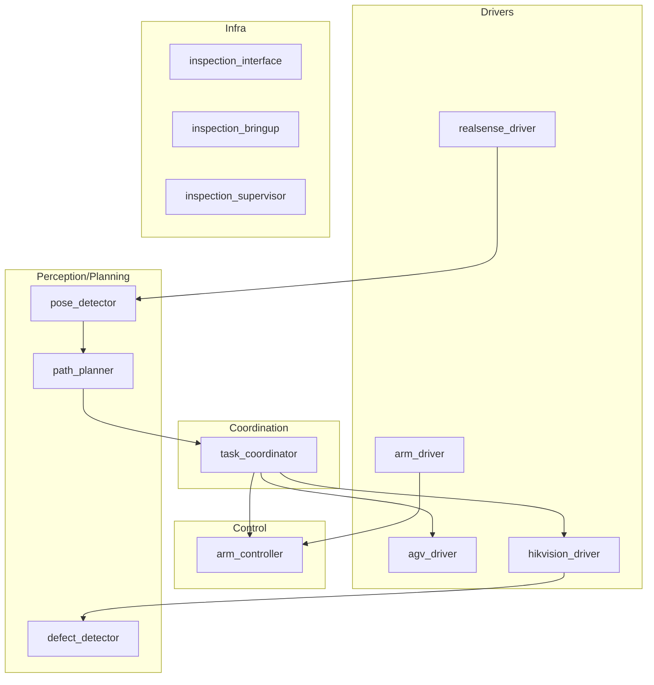

# inspection-robot

机器人端 ROS 2 工作空间：包含 AGV/机械臂/相机驱动，以及规划/感知/协调等包的工程骨架。

系统整体分工（建议先看 `docs/WORKSPACE_OVERVIEW.md`）：

`inspection-hmi -> inspection_gateway(gRPC) -> ROS2(task_coordinator + drivers/controllers)`

上位机侧的“任务/计划/状态/事件/媒体资源”语义以 `inspection-api/proto/inspection_gateway.proto` 为准，本仓库负责把设备能力封装为 ROS 2 接口并在机器人端落地执行。

## 1. 当前阶段的约束（很重要）

1. **API 优先级（从高到低）**
   - `inspection-api/proto/inspection_gateway.proto`：上位机与机器人之间的对外契约（算法与上位机以此为准）
   - `inspection_interface`：机器人内部 ROS2 msg/srv（对齐网关语义）
   - 设备厂商协议（AGV TCP API/相机 SDK）：只允许在各自 `*_driver` 内部使用
2. **坐标系约定**
   - AGV 导航目标与 AGV 当前位姿统一使用地图坐标系（默认 `map`，单位 m/rad）。
   - 机械臂状态可视化/相机取图姿态建议也统一到 `map`（便于 HMI 叠加显示）。
   - 具体输入校验与边界条件以实现为准（见 `src/agv_driver/README.md`）。
3. **命名空间约定**
   - 建议所有节点运行在 `/inspection/*` 下；节点内部优先使用相对话题名 `~/`，避免硬编码绝对话题名。

## 2. 环境与构建

- Ubuntu 22.04
- ROS 2 Humble
- GCC 11+（C++17）
- Python 3.10+

构建（在 `inspection-robot/` 目录）：

```bash
colcon build --symlink-install
source install/setup.bash
```

## 3. 启动方式

驱动集合（优先用 bringup 统一启动）：

```bash
ros2 launch inspection_bringup drivers.launch.py
```

一键启动（逐步补齐中）：

```bash
ros2 launch inspection_bringup system.launch.py
```

单包启动（调试/联调时常用）：

```bash
ros2 launch agv_driver agv_driver.launch.py
ros2 launch arm_driver arm_driver.launch.py
ros2 launch hikvision_driver hikvision_driver.launch.py
ros2 launch arm_controller arm_controller.launch.py
```

bringup 是统一启动入口；单包 launch 默认读取包内 `config/*.yaml`。如需复用 bringup 的配置，直接在 launch 里传 `params_file:=/absolute/path/to/*.yaml`。

## 4. 功能包索引（以实现为准）

| 包 | 职责一句话 | 说明文档 |
|---|---|---|
| `agv_driver` | AGV 底盘 TCP 驱动：`goal_pose/cmd_vel` -> TCP，下发导航并发布状态 | `src/agv_driver/README.md` |
| `arm_driver` | 机械臂 EtherCAT 驱动：关节指令/状态与使能等服务 | `src/arm_driver/README.md` |
| `realsense_driver` | vendoring 官方 `realsense2_camera` 并提供 bringup 配置 | `src/realsense_driver/README.md` |
| `hikvision_driver` | 海康工业相机驱动（持续补齐中） |（待补齐 README） |
| `arm_controller` | 机械臂控制层（MoveIt2/IK 等，持续补齐中） |（待补齐 README） |
| `pose_detector` | 工件 6D 位姿检测（持续补齐中） |（待补齐 README） |
| `path_planner` | 联合站位/IK 的规划（持续补齐中） |（待补齐 README） |
| `defect_detector` | 缺陷检测（持续补齐中） |（待补齐 README） |
| `task_coordinator` | 任务编排/状态机（持续补齐中） |（待补齐 README） |
| `inspection_interface` | 机器人内部 msg/srv 定义（对齐网关语义） | `src/inspection_interface/msg`、`src/inspection_interface/srv` |
| `inspection_bringup` | launch/配置统一入口 | `src/inspection_bringup/launch`、`src/inspection_bringup/config` |
| `inspection_supervisor` | 系统监控（可选） |（待补齐 README） |

## 5. 系统架构（当前工程视角）



## 6. 导航地图（GetNavMap）与 AGV 地图能力

HMI 的导航视图通常需要“底图 + 分辨率 + 原点”，这些信息来源于 AGV 地图文件（位于底盘控制器上）。

在本工程分层约束下，建议由 `agv_driver` 封装厂商 TCP API，然后由 `inspection_gateway`/`task_coordinator` 调用：

- `1300 robot_status_map_req`：查询当前载入地图名与 md5、保存的地图列表  
  参考：`src/agv_driver/docs/agv_api/API/TCP-IP API/机器人状态API/查询机器人载入的地图以及储存的地图.md`
- `4011 robot_config_downloadmap_req`：按 `map_name` 下载 `.smap`（JSON 文本）  
  参考：`src/agv_driver/docs/agv_api/API/TCP-IP API/机器人配置API/从机器人下载地图.md`
- `.smap` 格式说明（坐标单位为米，地图坐标系即世界坐标系）  
  参考：`src/agv_driver/docs/agv_api/API/TCP-IP API/机器人配置API/地图格式说明.md`

对内 ROS2 接口建议固定为一个 service（供 `inspection_gateway` 调用）：

- `/inspection/agv/get_nav_map`：`inspection_interface/srv/GetNavMap`

对外接口（gRPC）侧的像素投影约定以 `inspection-api/proto/inspection_gateway.proto` 的 `NavMapInfo` 注释为准。

## 7. TF 约定（最小集合）

为了对齐“导航地图 + 底盘位姿 + 机械臂位姿 + 相机取图姿态”，机器人端至少需要以下 TF 链（推荐）：

1. `map`：AGV 的世界坐标系（地图坐标系）
2. `base_link`：AGV 底盘坐标系（底盘本体）
3. `arm_base`：机械臂基座坐标系（安装在底盘上，需要静态标定）
4. `tcp`：机械臂末端工具坐标系（由 URDF/正解得到）
5. `camera`：工业相机坐标系（相对 tcp 的外参，需要静态标定）

`agv_driver` 可选发布：`map -> base_link`（以及 `PoseStamped` 当前位姿）。

注意：当前 `inspection_bringup` 里存在“末端到工业相机”的静态 TF 示例，但 frame 名称需要与 URDF 一致后才能用于规划/可视化（见 `src/inspection_bringup/launch/drivers.launch.py`）。

## 8. 消息/服务定义（不在 README 重复抄写）

为了避免 README 和代码出现“字段不一致”，本仓库不在此处复制 `.msg/.srv` 内容。

- 机器人内部接口：`src/inspection_interface/msg`、`src/inspection_interface/srv`
- 对外契约：`inspection-api/proto/inspection_gateway.proto`（以该仓库为准）

## 9. 测试与联调建议（按工程阶段）

本项目更关心“能把系统跑起来并可定位问题”，因此只保留最实用的三类验证：

1. A 级：纯逻辑单测（`colcon test` 能跑，且不依赖真机）
2. B 级：离线回放/仿真（可选）
3. C 级：真机联调清单（更重要，但不进 CI）

根 README 不再重复列出每个包的 topic/service/参数细节（容易与实现漂移），以各包 README 与代码为准。

建议每个包至少提供一段“功能性验证清单”（不做算法正确性判断，只验证接口/联通/基本行为）：

- `agv_driver`：连通；下发导航目标成功；到位与停止判定可用（安全场地）。
- `arm_driver`：EtherCAT 连通；关节与驱动状态更新；基础控制服务可用。
- 相机：图像/深度/点云发布稳定；配置可复现。

## 10. 代码规范（必须遵守）

1. 格式化：工作区根目录 `.clang-format`
2. 静态检查：工作区根目录 `.clang-tidy`
3. 强制命名：`class` 的 `private` 成员变量必须以下划线 `_` 开头（例：`_frame_id`、`_retry_count`）。
