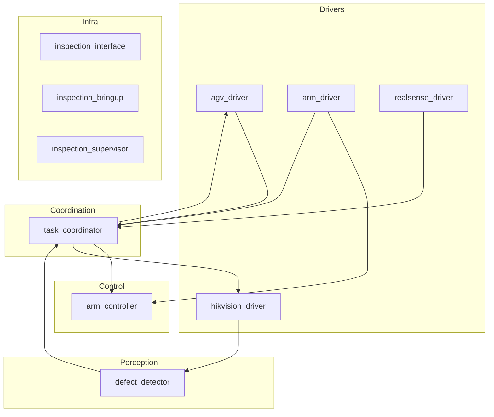

# inspection-robot

机器人端 ROS 2 工作空间：**基于移动协作机械臂的大型工件视觉检测/巡检系统**。包含 AGV、机械臂、RealSense 深度相机、海康工业相机、缺陷检测与任务编排等功能包。

> 当前课题方向已改回 `fa97514` 之前的巡检/视觉检测方向。仓库中保留的 `inspection_gateway`、`inspection_sim`、`dio_driver` 等包属于历史工程能力或可选辅助模块，不再作为论文主线；本文档默认不依赖网页前端和 fake driver。

## 0. 硬件与任务

- AGV（仙宫智能）+ 协作机械臂（大族 E05 / Elfin5）+ RealSense 深度相机（末端安装）+ 海康工业相机（末端安装）
- 算力：Jetson Orin AGX 64G
- 目标任务：**大型工件多站位自动巡检、工作距微调、图像采集与缺陷检测**

主执行链路：

```text
ROS2 CLI / launch / RViz
  -> task_coordinator
  -> agv_driver / arm_controller / realsense_driver / hikvision_driver / defect_detector
```

## 1. 当前阶段的约束

1. **机器人内部接口优先**
   - `inspection_interface`：机器人内部 ROS2 msg/srv 的主要契约。
   - `task_coordinator`：巡检任务状态机的执行入口。
   - 厂商协议（AGV TCP API、相机 SDK、机械臂 SDK）只允许在各自 driver 内部使用。
2. **不以网页为主线**
   - 当前论文与系统演示默认通过 ROS2 launch、RViz、ros2 CLI 和脚本完成。
   - `inspection_gateway` 保留为历史/可选模块，不作为论文必须功能。
3. **不以 fake driver 为主线**
   - 当前验收以真机、半实物或离线数据回放为准。
   - `inspection_sim` 若存在，仅作为历史辅助，不作为论文系统架构依赖。
4. **坐标系约定**
   - AGV 位姿与导航目标使用 `map` 坐标系（单位 m/rad）。
   - 机械臂基座 `arm_base` 相对 `base_link` 需要静态标定。
   - 末端相机外参 `tool0 -> hikvision_frame` / `tool0 -> camera_link` 需要统一配置。
   - 深度微调阶段使用 RealSense 深度图估计相机到工件局部表面的工作距离。
5. **命名空间约定**
   - 建议所有节点运行在 `/inspection/*` 下。
   - 跨包 ROS API 使用相对话题名，通过 launch namespace 固定前缀。
   - `~/` 仅用于节点私有调试接口。

## 2. 环境与构建

- Ubuntu 22.04
- ROS 2 Humble
- GCC 11+（C++17）
- Python 3.10+

```bash
source /opt/ros/humble/setup.bash
colcon build --symlink-install
source install/setup.bash
```

系统依赖：

```bash
sudo apt install ros-humble-realsense2-camera ros-humble-librealsense2
sudo apt install ros-humble-moveit

# 缺陷检测算法可按最终路线选择安装
pip install ultralytics opencv-python
```

## 3. 启动方式

驱动集合：

```bash
ros2 launch inspection_bringup drivers.launch.py
```

完整巡检系统：

```bash
ros2 launch inspection_bringup system.launch.py
```

单包调试：

```bash
ros2 launch agv_driver agv_driver.launch.py
ros2 launch arm_driver arm_driver.launch.py
ros2 launch hikvision_driver hikvision_driver.launch.py
ros2 launch realsense_driver realsense.launch.py
ros2 launch arm_controller arm_controller.launch.py
ros2 launch task_coordinator task_coordinator.launch.py
```

## 4. 功能包索引

| 包 | 主线职责 | 状态 |
|---|---|---|
| `agv_driver` | AGV 底盘 TCP 驱动，下发站位导航并发布状态 | 主线 |
| `arm_driver` | 机械臂底层驱动，发布关节状态与基础控制服务 | 主线 |
| `arm_controller` | MoveIt2 运动控制，提供 `move_to_joints` / `move_to_pose` | 主线 |
| `realsense_driver` | RealSense 深度相机适配，提供工作距微调用深度图 | 主线 |
| `hikvision_driver` | 海康工业相机驱动，提供触发拍照与图像发布 | 主线 |
| `defect_detector` | 工业图像缺陷检测，输出结构化缺陷结果 | 主线，算法待补 |
| `task_coordinator` | 多站位巡检状态机编排 | 主线 |
| `inspection_interface` | ROS2 msg/srv 定义 | 主线 |
| `inspection_bringup` | launch 与参数配置入口 | 主线 |
| `inspection_supervisor` | 系统健康监控 | 可选 |
| `inspection_gateway` | FastAPI 网关 | 历史/可选，不作为当前论文主线 |
| `inspection_sim` | fake driver 仿真 | 历史/可选，不作为当前论文主线 |
| `dio_driver` | DIO 通用驱动 | 非巡检主线，可保留 |

## 5. 系统架构


```mermaid
flowchart TB
  subgraph Drivers["Drivers"]
    AGV["agv_driver"]
    ARM["arm_driver"]
    RS["realsense_driver"]
    HK["hikvision_driver"]
  end

  subgraph Control["Control"]
    AC["arm_controller"]
  end

  subgraph Algo["Perception"]
    DET["defect_detector"]
  end

  subgraph Coord["Coordination"]
    CO["task_coordinator"]
  end

  subgraph Infra["Infra"]
    IF["inspection_interface"]
    BR["inspection_bringup"]
    SUP["inspection_supervisor"]
  end

  CO --> AGV
  CO --> AC
  RS --> CO
  CO --> HK
  HK --> DET
  DET --> CO
  AGV --> CO
  ARM --> AC
  ARM --> CO
```

## 6. 巡检任务 pipeline

```text
IDLE
  -> MOVING_TO_STATION    AGV 到 YAML 配置站位
  -> ARM_PRESET           机械臂到预设观测关节角
  -> DEPTH_ADJUST         RealSense 测距，末端工作距微调
  -> CAPTURING            海康相机拍照 + defect_detector 检测
  -> 下一站位 / COMPLETED

任一阶段失败 -> FAILED
支持 PAUSE / RESUME / STOP
```

站位配置示例见 `src/inspection_bringup/config/inspection_stations.yaml`：

```yaml
stations:
  - name: "station_1"
    agv_pose: {x: 1.0, y: 2.0, z: 0.0, yaw: 0.5}
    arm_joints: [0.0, -0.5, 1.2, 0.0, 0.8, 0.0]
    target_distance: 0.30
    distance_tolerance: 0.02
    adjust_axis: "z"
```

## 7. 工作距微调算法

巡检方向的核心算法之一是：**基于 RGB-D 局部深度/局部点云的非平面工件工作距自适应微调**。

基础实现：

1. 机械臂到预设观测位。
2. 读取 RealSense aligned depth。
3. 在目标 ROI 内提取有效深度。
4. 使用中值或局部点云拟合估计当前工作距。
5. 与 `target_distance` 比较。
6. 若超过 `distance_tolerance`，调用 `arm_controller/move_to_pose` 做小范围位姿修正。
7. 重复直到满足容差或超过最大重试次数。

增强实现（论文建议）：

- 将 ROI 深度反投影为点云。
- 使用滤波剔除离群点。
- 用 PCA / RANSAC 拟合局部切平面。
- 计算相机到局部切平面的距离，不假设整个工件是平面。
- 将距离误差转换成机械臂末端修正量。

## 8. 缺陷检测算法

`defect_detector` 作为主算法包，建议按以下路线实现：

- 有缺陷标注数据：使用 YOLOv8-seg 做缺陷检测/实例分割。
- 缺陷样本少：使用 PatchCore / PaDiM 做异常检测，输出热力图并阈值分割。
- 后处理输出缺陷类别、置信度、bbox/mask、面积、中心位置和标注图。

当前代码中 `defect_detector` 仍是骨架，正式论文实验前必须补齐真实推理与结果统计。

## 9. 结果与验证

当前主线不依赖网页。结果建议通过以下方式验证与展示：

- RViz：查看 TF、AGV/机械臂位姿、相机坐标系。
- ros2 topic：查看 `/inspection/state`、相机图像、缺陷结果。
- ros2 service：启动/暂停/停止任务，调用相机触发与运动控制服务。
- 文件落盘：保存原图、标注图和实验 CSV，用于论文统计。

建议实验指标：

- AGV 到位误差。
- 机械臂重复定位误差。
- 深度微调前后工作距误差。
- 不同曲率/倾角表面的局部距离估计误差。
- 缺陷检测 Precision、Recall、mAP、F1。
- 单站位耗时与整轮巡检耗时。

## 10. 代码规范

1. 格式化：工作区根目录 `.clang-format`
2. 静态检查：工作区根目录 `.clang-tidy`
3. 强制命名：`class` 的 `private` 成员变量必须以下划线 `_` 开头（例：`_frame_id`、`_retry_count`）。
