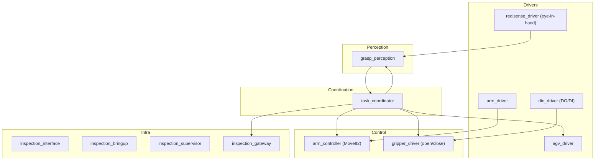

# inspection-robot

机器人端 ROS 2 工作空间：**复合移动机器人抓取系统**。包含 AGV / 机械臂 / 相机 / DIO 驱动，以及感知 / 规划 / 编排等功能包。

> **历史说明**：仓库名与大部分 `inspection_*` 包名来自早期"大型工件视觉检测/巡检"场景。课题已调整为"复合机器人抓取"，保留旧名是为了避免大范围破坏性重命名；新增能力一律使用功能命名（`grasp_perception` / `gripper_driver` 等）。

## 0. 硬件与任务

- AGV（仙宫智能）+ 协作机械臂（大族 E05 / Elfin5）+ RealSense 深度相机（**eye-in-hand**，装末端）+ 气动二指夹爪
- 算力：Jetson Orin AGX 64G
- 目标任务：**已知工业件的单次抓取 + 放置**

系统整体分工（建议先看 `docs/WORKSPACE_OVERVIEW.md`）：

`inspection-site -> inspection_gateway(REST/WS) -> ROS2(task_coordinator + drivers/controllers + 感知/夹爪)`

上位机与机器人之间的"任务/进度/状态/事件/媒体"语义以 `inspection_gateway/api/models.py` 为准，本仓库负责把设备/感知/控制能力封装为 ROS 2 接口并在机器人端落地执行。

## 1. 当前阶段的约束（很重要）

1. **API 优先级（从高到低）**
   - `inspection_gateway/api/models.py`：上位机与机器人之间的对外契约（算法与上位机以此为准）
   - `inspection_interface`：机器人内部 ROS2 msg/srv（对齐网关语义）
   - 设备厂商协议（AGV TCP API / RealSense SDK / 相机 SDK / GPIO）：只允许在各自 `*_driver` 内部使用
2. **坐标系约定**
   - AGV 位姿与导航目标使用 `map` 坐标系（单位 m/rad）。
   - 机械臂基座 `arm_base` 相对 `base_link` 静态标定。
   - 手眼：相机 `camera_color_optical_frame` 相对 `tool0` 由手眼标定得到。
   - 抓取位姿对外统一表达到 `arm_base` 或 `base_link`；感知内部在 `camera_color_optical_frame` 即可，跨包前先变换。
3. **命名空间约定**
   - 建议所有节点运行在 `/inspection/*` 下（历史命名保留）。
   - **跨包/对外 ROS API**：使用相对话题名（不以 `/` 或 `~` 开头），并通过 launch 的 `namespace` 固定前缀。
   - `~/` 仅用于节点真正"私有"的内部调试话题/服务。

## 2. 环境与构建

- Ubuntu 22.04
- ROS 2 Humble
- GCC 11+（C++17）
- Python 3.10+

构建（在 `inspection-robot/` 目录）：

```bash
colcon build --symlink-install
source install/setup.bash
```

系统依赖：

```bash
sudo apt install ros-humble-realsense2-camera ros-humble-librealsense2
sudo apt install ros-humble-moveit
pip install ultralytics opencv-python open3d   # grasp_perception 规划使用
```

## 3. 启动方式

驱动集合（优先用 bringup 统一启动）：

```bash
ros2 launch inspection_bringup drivers.launch.py
```

一键启动（逐步补齐中）：

```bash
ros2 launch inspection_bringup system.launch.py
```

单包启动（调试/联调时常用）：

```bash
ros2 launch agv_driver agv_driver.launch.py
ros2 launch arm_driver arm_driver.launch.py
ros2 launch realsense_driver realsense.launch.py
ros2 launch arm_controller arm_controller.launch.py
```

bringup 是统一启动入口；单包 launch 默认读取包内 `config/*.yaml`。如需复用 bringup 的配置，直接在 launch 里传 `params_file:=/absolute/path/to/*.yaml`。

## 4. 功能包索引（以实现为准）

| 包 | 职责一句话 | 说明文档 |
|---|---|---|
| `agv_driver` | AGV 底盘 TCP 驱动：`goal_pose/cmd_vel` -> TCP，下发导航并发布状态 | `src/agv_driver/README.md` |
| `arm_driver` | 机械臂 EtherCAT 驱动：关节指令/状态与使能等服务 | `src/arm_driver/README.md` |
| `realsense_driver` | vendoring 官方 `realsense2_camera` 并提供 bringup 配置（核心传感器，eye-in-hand） | `src/realsense_driver/README.md` |
| `dio_driver` | 工控机板载 DIO（TCA9539 GPIO 扩展）底层驱动，提供 `set_output`/`status` | `src/dio_driver/CLAUDE.md` |
| `gripper_driver` | 气动二指夹爪语义层（open/close），底层调用 `dio_driver` **[规划新增]** | — |
| `arm_controller` | 机械臂控制层（MoveIt2，Pilz LIN 用于 PRE_GRASP→GRASP 直线段） | — |
| `grasp_perception` | 目标检测 + 抓取位姿生成（YOLOv8+深度 / 6D 位姿估计） **[规划新增]** | — |
| `task_coordinator` | 抓取任务状态机编排 | `src/task_coordinator/CLAUDE.md` |
| `inspection_interface` | 机器人内部 msg/srv 定义（对齐网关语义） | `src/inspection_interface/msg`、`src/inspection_interface/srv` |
| `inspection_gateway` | FastAPI REST/WS 网关：HMI <-> ROS2 桥接 | `src/inspection_gateway/CLAUDE.md`、`docs/INSPECTION_GATEWAY_DESIGN.md` |
| `inspection_bringup` | launch/配置统一入口 | `src/inspection_bringup/launch`、`src/inspection_bringup/config` |
| `inspection_supervisor` | 系统健康监控（可选） | `src/inspection_supervisor/CLAUDE.md` |
| `inspection_sim` | 无硬件端到端联调 fake drivers + sim launch | `src/inspection_sim/README.md` |
| `hikvision_driver` | 海康工业相机驱动 **[巡检遗留，抓取场景默认不启用，仅保留备用]** | — |
| `defect_detector` | 图像缺陷检测 **[巡检遗留，抓取场景不使用，待清理]** | — |

## 5. 系统架构（当前工程视角）


```mermaid
flowchart TB
  subgraph Drivers["Drivers"]
    D1["agv_driver"]
    D2["arm_driver"]
    D3["realsense_driver (eye-in-hand)"]
    D4["dio_driver (DO/DI)"]
  end

  subgraph Control["Control"]
    C1["arm_controller (MoveIt2)"]
    C2["gripper_driver (open/close)"]
  end

  subgraph Algo["Perception"]
    A1["grasp_perception"]
  end

  subgraph Coord["Coordination"]
    CO1["task_coordinator"]
  end

  subgraph Infra["Infra"]
    I1["inspection_interface"]
    I2["inspection_bringup"]
    I3["inspection_supervisor"]
    I4["inspection_gateway"]
  end

  D3 --> A1
  A1 --> CO1
  D2 --> C1
  D4 --> C2
  CO1 --> D1
  CO1 --> C1
  CO1 --> C2
  CO1 --> A1
  CO1 --> I4
```

## 6. 抓取任务 pipeline（状态机）

```
IDLE
 └─ NAV_TO_PICK          AGV 到抓取点位（可选）
     └─ ARM_TO_OBSERVE    机械臂到观察位
         └─ CAPTURE_RGBD  RealSense 抓一帧 RGB + Depth + 内参
             └─ PERCEIVE  grasp_perception → grasp_pose(camera_frame)
                 └─ TRANSFORM_IK  → arm_base + MoveIt 可达性
                     └─ PRE_GRASP  Pilz LIN 到抓取点上方 10cm
                         └─ GRASP       Pilz LIN 直线下压
                             └─ CLOSE_GRIPPER
                                 └─ LIFT
                                     └─ NAV_TO_PLACE（可选）
                                         └─ PLACE / OPEN_GRIPPER / HOME
                                             └─ IDLE

任一阶段失败 → RECOVERY（重拍/重规划 N 次 → 超限终止并发事件）
```

详细说明见 `docs/ARCHITECTURE.md` 与 `src/task_coordinator/CLAUDE.md`。

## 7. 导航地图（GetNavMap）与 AGV 地图能力

HMI 的导航视图需要"底图 + 分辨率 + 原点"，这些信息来源于 AGV 地图文件（位于底盘控制器上）。

本工程分层约束：由 `agv_driver` 封装厂商 TCP API，然后由 `inspection_gateway`/`task_coordinator` 调用：

- `1300 robot_status_map_req`：查询当前载入地图名与 md5、保存的地图列表
  参考：`src/agv_driver/docs/agv_api/API/TCP-IP API/机器人状态API/查询机器人载入的地图以及储存的地图.md`
- `4011 robot_config_downloadmap_req`：按 `map_name` 下载 `.smap`（JSON 文本）
  参考：`src/agv_driver/docs/agv_api/API/TCP-IP API/机器人配置API/从机器人下载地图.md`
- `.smap` 格式说明（坐标单位为米，地图坐标系即世界坐标系）
  参考：`src/agv_driver/docs/agv_api/API/TCP-IP API/机器人配置API/地图格式说明.md`

对内 ROS2 接口建议固定为一个 service（供 `inspection_gateway` 调用）：

- `/inspection/agv/get_nav_map`：`inspection_interface/srv/GetNavMap`

对外接口（REST/WS）侧的像素投影约定以 `inspection_gateway/api/models.py` 的 `NavMapInfo` 为准。

## 8. TF 约定（最小集合）

```
map                              ← agv_driver 发布 map -> base_link
 └─ base_link (AGV)
     └─ arm_base                  ← 静态 TF（机械臂安装标定，必须补齐）
         └─ elfin_link1..6
             └─ tool0              ← URDF 正解
                 ├─ gripper_tip    ← 静态 TF（气动夹爪末端 offset）
                 └─ camera_link    ← 手眼标定（tool0 -> camera_link）
                     └─ camera_color_optical_frame  ← RealSense 发布
```

关键标定：
- `base_link -> arm_base`：静态标定 yaml，由 `inspection_bringup` 静态 TF 发布
- `tool0 -> camera_link`：手眼标定（推荐 `easy_handeye2` + ChArUco），存 yaml 启动时加载
- `tool0 -> gripper_tip`：夹爪机械 offset（量一次写死）

> 注意：drivers.launch.py 中原 `tool0 -> hikvision_frame` 的静态 TF 示例基于工业相机，抓取场景已不再使用；替换为 `tool0 -> camera_link` + `tool0 -> gripper_tip`。

## 9. 消息/服务定义（不在 README 重复抄写）

为了避免 README 和代码出现"字段不一致"，本仓库不在此处复制 `.msg/.srv` 内容。

- 机器人内部接口：`src/inspection_interface/msg`、`src/inspection_interface/srv`
- 对外契约：`src/inspection_gateway/inspection_gateway/api/models.py`（以该文件为准）

新增（规划）消息/服务见 `TODO.md`，例如：
- `srv/PerceiveGrasp`：感知接口，输入可选 `object_class`，输出 `grasp_pose` 候选列表
- `srv/Grasp`（或 action）：面向上位机的"抓取任务"入口，替代原 `StartInspection`

## 10. 测试与联调建议（按工程阶段）

本项目更关心"能把系统跑起来并可定位问题"，因此只保留最实用的三类验证：

1. A 级：纯逻辑单测（`colcon test` 能跑，且不依赖真机）
2. B 级：离线回放/仿真（`inspection_sim`）
3. C 级：真机联调清单（更重要，但不进 CI）

各包"功能性验证清单"（不做算法正确性判断，只验证接口/联通/基本行为）：

- `agv_driver`：连通；下发导航目标成功；到位与停止判定可用（安全场地）。
- `arm_driver`：EtherCAT 连通；关节与驱动状态更新；基础控制服务可用。
- `realsense_driver`：color/depth/aligned_depth/intrinsics/TF 发布稳定。
- `dio_driver`：`set_output` 能驱动 DO 灯/电磁阀；`status` 能读回 DI。
- `gripper_driver`（新）：`open` / `close` 服务能带动夹爪实物动作。
- `grasp_perception`（新）：给定样例 RGBD → 输出合理抓取候选（可 rviz 可视化）。
- `arm_controller`：MoveIt2 到 `move_to_pose` + Pilz LIN 短距直线可达。
- `task_coordinator`：无硬件（`inspection_sim`）跑通抓取 pipeline。

## 11. 代码规范（必须遵守）

1. 格式化：工作区根目录 `.clang-format`
2. 静态检查：工作区根目录 `.clang-tidy`
3. 强制命名：`class` 的 `private` 成员变量必须以下划线 `_` 开头（例：`_frame_id`、`_retry_count`）。
