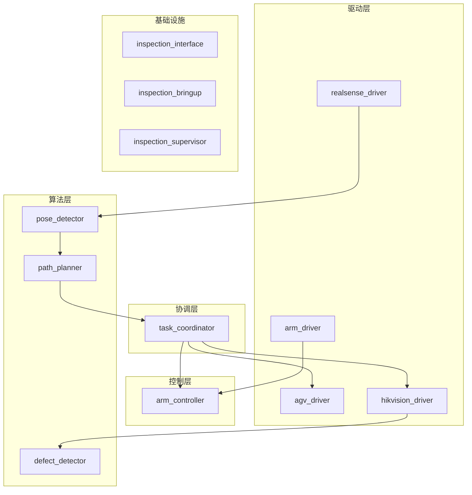

# 基于移动协作机械臂的大型工件视觉检测系统

## 1. 项目背景

在航空制造领域，飞机机翼表面缺陷检测、发动机装配确认等质检任务面临显著挑战。传统固定式AOI设备检测范围有限，无法对大型工件进行全覆盖检测，且设备部署位置固定，难以适应不同检测角度需求。本项目拟开发一套移动式视觉检测系统，通过AGV与协作机械臂的集成，实现大型工件的灵活多角度检测。

## 2. 系统组成

本系统由以下硬件构成：
- 仙宫智能AGV（移动平台，具备SLAM导航）
- 大族E05协作机械臂（6自由度）
- Intel RealSense深度相机（末端安装）
- 海康工业相机（末端安装）

## 3. 环境要求

- **操作系统**: Ubuntu 22.04 (Jammy Jellyfish)
- **ROS版本**: ROS 2 Humble
- **编译器**: GCC 11+ (C++17)
- **Python**: 3.10+

## 4. 技术方案

### 4.1 联合站位与逆解求解（核心方法）

采用"AGV站位 + 机械臂逆解"的联合求解：

```math
\min_{b,q} J=
w_1\|b-b_{prev}\|^2+
w_2\|q-q_{prev}\|^2+
w_3\frac{1}{m(q)+\epsilon}+
w_4E_{view}+
w_5E_{limit}
```

### 4.2 执行闭环

```
for each inspection point:
  1) 计算并选择最优 (agv_goal, arm_goal)
  2) 下发 AGV 到 agv_goal
  3) 等待 arrived=true 且 stopped=true
  4) 机械臂 MoveJ 到 arm_goal
  5) 触发工业相机拍照
  6) 记录检测结果并进入下一点
```

## 5. 系统架构



## 6. 功能包设计

### 驱动层

| 包名 | 功能 |
|------|------|
| `agv_driver` | AGV底盘TCP驱动 |
| `arm_driver` | 机械臂EtherCAT驱动 |
| `hikvision_driver` | 海康工业相机驱动 |
| `realsense_driver` | RealSense深度相机 |

### 控制层

| 包名 | 功能 |
|------|------|
| `arm_controller` | MoveIt2运动控制 |

### 算法层

| 包名 | 功能 |
|------|------|
| `pose_detector` | 6D位姿检测 |
| `path_planner` | AGV+机械臂联合路径规划 |
| `defect_detector` | 图像缺陷检测 |

### 协调层

| 包名 | 功能 |
|------|------|
| `task_coordinator` | 任务状态机管理 |

### 基础设施

| 包名 | 功能 |
|------|------|
| `inspection_interface` | 消息/服务定义 |
| `inspection_bringup` | 启动管理 |
| `inspection_supervisor` | 系统监控 |

## 7. API 优先级

1. **外部契约层**：`inspection-api/proto/inspection_gateway.proto`
2. **机器人内部编排层**：`inspection_interface`
3. **设备厂商层**：AGV TCP API / 相机 SDK

## 8. 状态机

```
IDLE → LOCALIZING → PLANNING → EXECUTING → COMPLETED
           ↑___________↓__________↓ (出错可重试)
```

## 9. 代码规范

1. 格式化：`.clang-format`
2. 静态检查：`.clang-tidy`
3. **private成员变量必须以下划线 `_` 开头**
