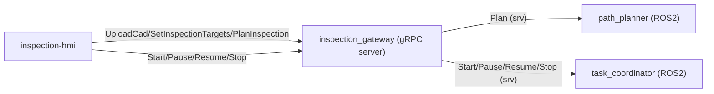
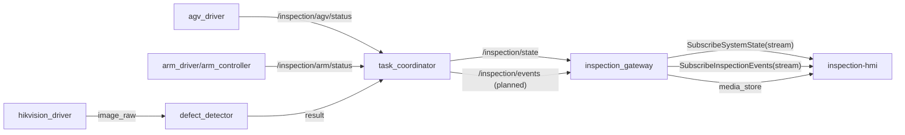

# 实现状态与代码规划（对齐 inspection-api）

本文档把 `inspection-api/proto/inspection_gateway.proto` 的对外能力，映射到 `inspection-robot` 的包结构/ROS2 接口，并标注**当前代码是否已存在**，避免“文档写了但代码没落地”。

## 1. 当前代码现状（快速结论）

- `inspection_gateway`（gRPC 服务端）：**包骨架已建立**（`src/inspection_gateway/`），但 gRPC handlers/存储/桥接逻辑尚未实现
- 导航地图 `GetNavMap`：
  - ROS2 `inspection_interface/srv/GetNavMap`：**已定义**
  - `agv_driver` `get_nav_map` service server：**缺失**
  - AGV 厂商地图 API(1300/4011/1513) 封装：**缺失**
- 规划 `PlanInspection`：`path_planner` 目前只有 `Trigger` 骨架，**不产出对外 `InspectionPath` 语义**
- 任务编排 `task_coordinator`：存在状态机骨架；现阶段主要用于跑通流程与联调，**尚未对齐 gRPC 的 plan/task/事件/媒体语义**
- 取图链路：`hikvision_driver` 已有 `trigger_capture` + `image_raw`，但**没有媒体落盘/媒体 id/事件流**的实现

## 2. gRPC 能力到机器人端模块映射（V1）

说明：
- “当前状态”仅描述仓库内是否已有可用模块，不代表算法正确性。
- 下面的“建议 ROS2 接口”是对内稳定契约，供 `inspection_gateway` 调用。

| gRPC RPC | 机器人端责任模块（建议） | 建议 ROS2 接口（对内） | 当前状态 |
|---|---|---|---|
| `UploadCad` | `inspection_gateway` + `cad_store` | （网关内处理即可） | 缺失 |
| `SetInspectionTargets` | `inspection_gateway` + `target_store` | `inspection_interface/srv/SetTargets`（待新增） | 缺失 |
| `PlanInspection` | `inspection_gateway` -> `path_planner` | `inspection_interface/srv/PlanInspection`（待新增，返回 waypoints/stats） | `path_planner` 仅有 Trigger 骨架 |
| `GetPlan` | `inspection_gateway` + `plan_store` | （网关内处理即可） | 缺失 |
| `StartInspection` | `inspection_gateway` -> `task_coordinator` | `/inspection/start` (`inspection_interface/srv/StartInspection`) | 已有骨架（字段未对齐 gRPC） |
| `PauseInspection` | `inspection_gateway` -> `task_coordinator` | `/inspection/pause` (`inspection_interface/srv/PauseInspection`) | 已有骨架 |
| `ResumeInspection` | `inspection_gateway` -> `task_coordinator` | `/inspection/resume` (`inspection_interface/srv/ResumeInspection`) | 已有骨架 |
| `StopInspection` | `inspection_gateway` -> `task_coordinator` | `/inspection/stop` (`inspection_interface/srv/StopInspection`) | 已有骨架 |
| `GetTaskStatus` | `inspection_gateway` -> `task_coordinator` | `/inspection/get_status` (`inspection_interface/srv/GetInspectionStatus`) | 已有骨架（对外仍需网关映射） |
| `SubscribeSystemState` | `inspection_gateway` 订阅 ROS2 状态并转发 | `/inspection/state` (`inspection_interface/msg/SystemState`) | 已有发布（字段较少） |
| `SubscribeInspectionEvents` | `inspection_gateway` 订阅事件并转发 | `/inspection/events`（待新增 msg） | 缺失 |
| `GetNavMap` | `inspection_gateway` 缓存 + `agv_driver` 提供原始能力 | `/inspection/agv/get_nav_map` (`inspection_interface/srv/GetNavMap`) | srv 已定义，server 缺失 |
| `ListCaptures` | `inspection_gateway` + `media_store`/`result_store` | （网关内处理即可） | 缺失 |
| `DownloadMedia` | `inspection_gateway` + `media_store` | （网关内处理即可，或暴露 HTTP） | 缺失 |

## 3. 代码层级结构建议（effect-first，可分期）

### 3.1 inspection_gateway（建议：Python 实现，跑通快）

网关桥接的详细设计见：`docs/INSPECTION_GATEWAY_DESIGN.md`。

当前状态：
- 包骨架已建立：`src/inspection_gateway/`

建议实现时遵循（后续实现）：

- `inspection-robot/src/inspection_gateway/`（独立进程，gRPC server）
- 逻辑分层：
  - `gateway/handlers/*`: proto RPC handlers（薄层）
  - `gateway/services/*`: 业务服务（cad/targets/plan/task/media/navmap）
  - `gateway/ros/*`: ROS2 client 适配层（rclpy clients/subscribers）
  - `gateway/store/*`: 本地落盘存储（plan/task/captures/media）

原因：
- gRPC + 文件/媒体处理在 Python 做迭代快
- ROS2 侧继续保留“驱动/控制/算法”核心在 C++

### 3.2 ROS2 侧（inspection-robot）

现有包的建议边界：

- `agv_driver`: 只封装厂商 TCP API + 发布状态 + 提供 `get_nav_map`
- `arm_driver`: 只做 EtherCAT 驱动 + 发布状态
- `arm_controller`: MoveIt2 执行层（TCP 目标姿态/MoveJ 轨迹）
- `pose_detector`: 工件位姿估计（对齐 `map`/`cad` 的 TF/外参）
- `path_planner`: 输入 targets + capture_config + 工件位姿，输出 waypoints（AGV pose + arm joint goal）
- `defect_detector`: 输入图像，输出缺陷结构化结果
- `task_coordinator`: 任务状态机与联锁门控（AGV 到位停止 -> 允许机械臂动作 -> 触发相机/检测）
- `inspection_interface`: 对内 msg/srv（逐步对齐 gRPC 语义）

## 4. 数据流（对齐“导航 + 机械臂 + 结果回显”）

### 4.1 控制面（Engineer/Operator）

### 4.2 状态与事件（监控与结果）

## 5. 标定/坐标与“相机角度”落点（必须统一）

要把 HMI 下发的 `view_direction/roll + focus_distance_m` 变成机械臂可执行的目标，关键是唯一的外参来源：

- `T_tcp_camera`：相机相对末端（TCP）的静态外参
  - 推荐来源：URDF 固定关节，或 `tf2_ros/static_transform_publisher`
  - 当前示例：`inspection_bringup/launch/drivers.launch.py`（注意 frame 名称需与 URDF 对齐）

规划/逆解的核心几何（概念）：

- `camera_pos = surface_pos - view_direction * focus_distance_m`
- `T_map_tcp_goal = T_map_camera_goal * inverse(T_tcp_camera)`

其中 `max_tilt_from_normal_deg` 等角度约束将用于筛掉不可行解（IK/碰撞/视角误差等）。

## 6. 下一步落地顺序（建议）

1. `inspection_gateway` 最小可用：`SubscribeSystemState` + `Start/Pause/Resume/Stop`（先走 ROS2 service/topic）
2. `GetNavMap` 跑通：`agv_driver` 增加 `get_nav_map` server（先返回元信息/缩略图即可，底图可后补）
3. `PlanInspection` 先做“可视化可用”的 waypoints（允许用固定模板/少量候选），优先让 HMI 有路径折线与点位高亮
4. 引入媒体落盘与事件：抓拍产生 `media_id`，事件带 `thumbnail_jpeg`，HMI 能回看
