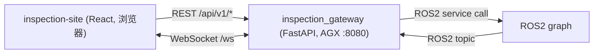

# inspection_gateway 设计（HMI ↔ ROS2 桥接）

> 详细实现状态、代码结构、端点清单见 `src/inspection_gateway/CLAUDE.md`。本文档侧重**设计决策与架构概览**。

## 架构演进

```
原架构:  inspection-api (proto)  ← gRPC →  inspection-hmi (Qt C++)  →  inspection_gateway (gRPC server, :50051)
现架构:  inspection-site (React) ← REST/WS → inspection_gateway (FastAPI, :8080) → ROS2
```

- `inspection-api` + `inspection-hmi` 已归档，不再维护
- 外部协议从 gRPC 迁移为 REST + WebSocket（降低前端接入门槛，支持浏览器直连）
- 数据契约从 `.proto` 迁移为 `api/models.py`（Pydantic v2），OpenAPI 文档自动生成

## 1. 部署与通信边界

- 部署位置：机器人端（AGX / 工控机），与 ROS2 同进程
- 前端访问：浏览器通过局域网访问 `http://<robot_ip>:8080`
- 外部协议：REST（`/api/v1/...`）+ WebSocket（`/ws`）
- 内部协议：ROS2（topic/service），由 gateway 屏蔽 ROS2 细节

端口（可配置）：`8080`（REST + WS + 前端静态文件，统一端口）

## 2. Gateway 的职责

1. **协议适配**：实现 REST API + WebSocket 端点，保持对外字段/语义稳定（以 `api/models.py` 为准）
2. **ROS2 桥接**：把 HTTP 请求映射为 ROS2 service call，把 ROS2 topic 订阅映射为 WebSocket 推送
3. **存储**：
   - CAD 文件（`CadStore`，SHA256 内容寻址）
   - 媒体资源（`MediaStore`，SHA256 内容寻址）
   - Targets/Plans/Task 运行时状态（`GatewayRuntime`，内存缓存）
4. **前端托管**：`frontend/dist/` 由 FastAPI 静态文件中间件托管
5. **状态推送**：WebSocket 推送 `system_state`（来自 ROS2 `SystemState` topic）

不做（V1）：
- 复杂权限/账号系统
- TLS/证书（需要时再加）
- 持久化数据库（当前用内存 + 文件系统）

## 3. REST/WS ↔ ROS2 映射

### 3.1 控制面

| HTTP 端点 | ROS2 服务 | 接口类型 |
|-----------|----------|----------|
| `POST /api/v1/tasks` | `/inspection/start` | `StartInspection.srv` |
| `POST /api/v1/tasks/{id}/pause` | `/inspection/pause` | `PauseInspection.srv` |
| `POST /api/v1/tasks/{id}/resume` | `/inspection/resume` | `ResumeInspection.srv` |
| `POST /api/v1/tasks/{id}/stop` | `/inspection/stop` | `StopInspection.srv` |
| `GET /api/v1/tasks/{id}/status` | `/inspection/get_status` | `GetInspectionStatus.srv` |

### 3.2 规划面

| HTTP 端点 | 当前实现 | 目标实现 |
|-----------|---------|---------|
| `POST /api/v1/targets` | gateway 侧存储到 `runtime.targets_by_model` | 同左（targets 由 gateway 管理） |
| `POST /api/v1/plans` | gateway 侧弧形路径生成（临时） | 对接 ROS2 `path_planner` srv |
| `GET /api/v1/plans/{plan_id}` | 从 `runtime.plans` 缓存读取 | 同左 |

### 3.3 导航地图与媒体

| HTTP 端点 | ROS2 服务 | 说明 |
|-----------|----------|------|
| `GET /api/v1/nav/map` | `/inspection/agv/get_nav_map` (`GetNavMap.srv`) | 图片写入 MediaStore，返回 media_id |
| `GET /api/v1/media/{media_id}` | — | 从 MediaStore 读取，StreamingResponse 256KB 分块 |

### 3.4 WebSocket 推送

| WS 消息类型 | ROS2 来源 | 实现状态 |
|------------|----------|---------|
| `system_state` | `/inspection/state` (`SystemState.msg`) | **已实现** |
| `inspection_event` | 待定（需 coordinator/detector 发布事件 topic） | **未实现** |
| `ping` / `pong` | — | **已实现** |

## 4. 数据流



## 5. 并发模型

```
┌──────────────────┐     ┌──────────────────────────────────┐
│ ROS2 Executor    │     │ uvicorn (asyncio 主线程)          │
│ (守护线程)        │     │                                  │
│                  │     │  HTTP handlers (sync, threadpool) │
│ SystemState.msg ─┼──→ StateHub ──→ WebSocket handler      │
│  callback        │     │                                  │
└──────────────────┘     └──────────────────────────────────┘
```

- ROS2 executor 在守护线程中运行（订阅回调、service client 完成回调）
- uvicorn 异步事件循环在主线程（HTTP、WebSocket）
- `StateHub` 通过线程安全的 `_LatestQueue(maxsize=1)` 桥接两个线程域
- `RosBridge._call()` 使用 `threading.Lock` 序列化 ROS2 service 调用

## 6. ID 与存储约定

| ID 类型 | 生成方式 | 说明 |
|---------|---------|------|
| `model_id` | SHA256(CAD bytes) | 内容寻址，相同文件同 ID |
| `plan_id` | UUID | 每次规划生成新 ID |
| `task_id` | UUID | 每次启动任务生成新 ID |
| `media_id` | SHA256(file bytes) | 内容寻址 |

存储根目录（可配置）：
- `cad_store/`：CAD 模型文件
- `media_store/`：地图图片、抓拍图片等媒体

## 7. 数据模型（三层一致性）

```
api/models.py (Pydantic v2)  ←→  inspection_interface (ROS2 msg/srv)  ←→  inspection-site/src/api/types.ts
```

修改任一层的数据模型时，必须同步更新其他两层。`api/models.py` 是 API 契约的**唯一事实来源**。

## 8. 文档与 TODO 维护（必须）

- REST/WS API 变化：更新 `src/inspection_gateway/CLAUDE.md`、`docs/WORKSPACE_OVERVIEW.md`、`TODO.md`
- ROS2 契约变化（topic/service）：同步更新 `docs/ARCHITECTURE.md`、相关包 `src/*/CLAUDE.md`、`TODO.md`
