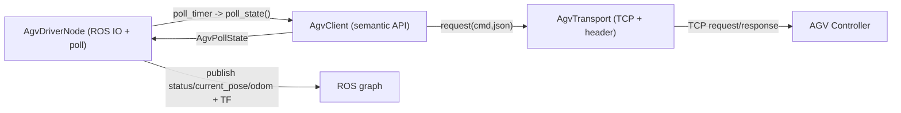

# agv_driver/CLAUDE.md

本文件约束 `agv_driver` 的代码分层与数据流，目标是：**Node 保持应用层轮询 + ROS IO；协议/TCP/厂商细节下沉**，避免单文件膨胀失控。

## 1. 包职责与边界

负责：
- 通过厂商 TCP-IP API 控制/轮询 AGV
- 把底盘能力封装为稳定 ROS2 接口（topic/service），供 `task_coordinator`/网关使用

不负责：
- 路径规划与任务编排（`path_planner`/`task_coordinator`）
- 上位机协议（`inspection_gateway`）

## 2. Public ROS API（稳定接口）

默认命名空间：`/inspection/agv`

订阅：
- `goal_pose` (`geometry_msgs/msg/PoseStamped`)：导航目标（`map_frame_id`）
- `cmd_vel` (`geometry_msgs/msg/Twist`)：开环速度调试

发布：
- `status` (`inspection_interface/msg/AgvStatus`)：底盘状态（断连也会发 `connected=false`）
- `current_pose` (`geometry_msgs/msg/PoseStamped`)：当前位姿（有有效位姿时才发）
- `odom` (`nav_msgs/msg/Odometry`)：速度/里程计（有有效位姿时才发）
- TF（可选）：`map_frame_id -> base_frame_id`

规划中：
- `get_nav_map` (`inspection_interface/srv/GetNavMap`)：封装 1300/4011/1513，给网关/HMI 导航底图用

## 3. 分层架构（强制）

保持 3 层以内，禁止反向依赖。

### 3.1 Node 层（应用层轮询）

文件：
- `src/agv_driver_node.cpp`

职责：
- 只做 ROS pub/sub、定时轮询、TF 发布、bootstrap/节流日志
- 通过 `_agv_client->poll_state()` 获取结构化状态
- 禁止在 Node 里写 socket、端口映射、16 字节协议头、cmd 号细节、复杂 JSON 字段解析

### 3.2 语义层（AGV 语义 API）

文件：
- `src/agv_client.cpp`
- `include/agv_driver/agv_client.hpp`

职责：
- 对 Node 暴露稳定语义函数：
  - `send_goal / send_open_loop_motion / stop_open_loop_motion / poll_state`
- 聚合并解析多条厂商命令（位置/速度/导航/电量/告警等）
- 把返回结果整理成纯 C++ struct（如 `AgvPollState`），避免 ROS 类型下沉

### 3.3 通信层（TCP/协议收发）

文件：
- `src/agv_transport.cpp`
- `include/agv_driver/agv_transport.hpp`

职责：
- cmd->port 路由表
- TCP 长连接复用、超时控制、重连策略
- 16 字节头打包/解包与收发
- 原始报文日志（可开关）

约束：
- 禁止在 transport 层理解“导航/电量/定位”等业务语义

## 4. 数据流（实际运行）

## 5. 代码组织建议（扩展时按此落地）

当 `agv_client.cpp` 开始膨胀时，拆成小模块，不要继续堆：
- `agv_driver/agv_cmd_position.*`
- `agv_driver/agv_cmd_speed.*`
- `agv_driver/agv_cmd_nav.*`
- `agv_driver/agv_cmd_battery.*`
- `agv_driver/agv_cmd_alarm.*`
- `agv_driver/agv_cmd_map.*`（支撑 `GetNavMap`）

## 6. 单测与联调建议

单测（不连真机）：
- 为 `AgvClient` 注入一个 fake transport（或在 transport 增加 `ITransport` 接口），回放 JSON 响应做解析测试

联调（真机）：
- 开 `log_io=true`，确认 cmd/port/seq 对齐
- `task_coordinator` 的到位门控建议只看 `/inspection/agv/status`，不要靠 `/current_pose` 推断到位

## 7. 文档与 TODO 维护（必须）

- 修改 public ROS API（topic/service/参数）时，必须同步更新：本文件、包内 `README.md`、`docs/ARCHITECTURE.md`、仓库根 `TODO.md`
- 新增功能但未实现完：必须把未完成项写入 `TODO.md`（带清晰落点与验收标准）
- 完成 TODO：必须勾选并在提交信息/PR 描述里说明验证方式（真机/仿真/回放）
