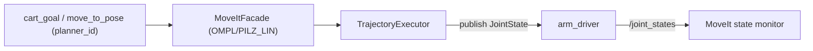

# arm_controller/CLAUDE.md

本文件约束 `arm_controller` 的架构与数据流，目标是：**MoveIt2 规划/执行逻辑与 ROS IO 解耦**，避免在回调里写长流程导致线程阻塞。

> **抓取方向要求**：`PRE_GRASP → GRASP → LIFT` 段必须走**直线插补**（LIN），OMPL 默认走弧线会撞工作台。必须启用 **Pilz industrial motion planner**，并在 `move_to_pose.srv` 里支持 `planner_id` 字段让 `task_coordinator` 选择 `OMPL` 或 `PILZ_LIN`。

## 1. 包职责与边界

负责：
- MoveIt2 规划 `PoseGoal -> JointTrajectory`（OMPL 走大范围；Pilz LIN 走直线段）
- 按策略把轨迹下发给 `arm_driver`（stream 或最终点）
- 对外提供 `move_to_pose` / `move_to_joints` service（供 `task_coordinator`/网关调用）
- 维护 MoveIt PlanningScene（工作台 / AGV 本体碰撞模型）

不负责：
- EtherCAT 硬件通信（`arm_driver`）
- 任务编排（`task_coordinator`）
- 抓取位姿生成（`grasp_perception`）

## 2. Public ROS API（稳定接口）

默认命名空间：`/inspection/arm_control`

订阅：
- `cart_goal` (`geometry_msgs/msg/PoseStamped`)：快速 plan+execute 调试入口
- `joint_goal` (`sensor_msgs/msg/JointState`)：透传关节命令
- `velocity_scaling` (`std_msgs/msg/Float64`)：速度缩放

发布：
- `motion_status` (`std_msgs/msg/String`)：planning / executing / done / failed
- `trajectory_progress` (`std_msgs/msg/Float64`)：0~1

服务：
- `move_to_pose` (`inspection_interface/srv/MoveToPose`)
  - **需扩展**：增加 `string planner_id`（默认 `OMPL`，抓取下压段传 `PILZ_LIN`）
  - 可扩展：`bool plan_only`（用于 `task_coordinator` 的可达性筛选，不执行）
- `move_to_joints` (`inspection_interface/srv/MoveToJoints`)

下游依赖：
- `arm_driver_joint_cmd_topic` 默认 `/inspection/arm/joint_cmd`
- 可选：`arm_driver_enable_service` 默认 `/inspection/arm/enable`

## 3. 推荐内部架构（保持 Node 轻量）

当前实现把逻辑集中在 `ArmControllerNode` 类里，后续扩展建议拆分为 3 个类：

1. `MoveItFacade`
   - 初始化 `MoveGroupInterface`
   - 加载 Pilz plugin（`pilz_industrial_motion_planner/PilzLINPlanner` 等）
   - 设置 planning time / scaling / target / planner_id
   - 管理 PlanningScene（工作台 box、AGV 本体 box、已抓工件 attached object）
2. `TrajectoryExecutor`
   - `execute_final_point` / `execute_trajectory(stream)` 的时序与 sleep
   - 进度发布与错误收敛
3. `DriverBridge`（可选）
   - auto-enable 调用
   - topic/service 名称集中管理，避免散落字符串常量

约束：
- ROS 回调里不要长期阻塞（MoveIt plan + stream 很慢）；建议把执行放到 worker 线程或独立 executor
- `plan_only=true` 时只返回 plan 结果（success + trajectory），不调 executor

## 4. 数据流

## 5. PlanningScene 约定（抓取场景）

必须把以下物体加入 PlanningScene，否则机械臂会撞底盘/工作台：

- `agv_body`：AGV 底盘的包围盒（从 URDF 或手动定义）
- `workspace_table`：工作台（若 AGV 上自带或外部平台）
- `attached_object`（动态）：CLOSE_GRIPPER 后，把"已抓工件"作为 attached object 附到 `gripper_tip`；OPEN_GRIPPER 前 detach。避免 LIFT 阶段 MoveIt 把工件当障碍物。

## 6. 与 `task_coordinator` 的边界

`task_coordinator` 在不同阶段调 `move_to_pose` 时传不同 `planner_id`：
- `ARM_TO_OBSERVE` → `move_to_joints`（OMPL）
- `PRE_GRASP` → `move_to_pose(planner_id=PILZ_LIN)`
- `GRASP` → `move_to_pose(planner_id=PILZ_LIN)`
- `LIFT` → `move_to_pose(planner_id=PILZ_LIN)`
- `TRANSFORM_IK`（可达性筛选）→ `move_to_pose(planner_id=OMPL, plan_only=true)`
- `HOME` → `move_to_joints(OMPL)`

## 7. 文档与 TODO 维护（必须）

- 修改 public ROS API（topic/service/参数）时，必须同步更新：本文件、相关 launch/config、`docs/ARCHITECTURE.md`、仓库根 `TODO.md`
- 新增功能但未实现完：必须把未完成项写入 `TODO.md`（带清晰落点与验收标准）
- 完成 TODO：必须勾选并在提交信息/PR 描述里说明验证方式（真机/仿真/回放）
