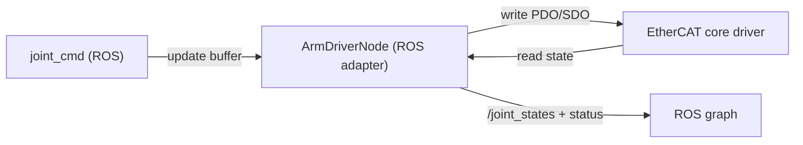

# arm_driver/CLAUDE.md

本文件约束 `arm_driver` 的分层与数据流，目标是：**ROS IO、EtherCAT 通信、状态/指令换算解耦**，避免所有逻辑堆在一个 Node 回调里。

## 1. 包职责与边界

负责：
- 通过 EtherCAT 与 Elfin5 硬件通信
- 发布 `/joint_states` 与 `inspection_interface/msg/ArmStatus`
- 提供 enable/disable/clear_fault/stop 等基础服务

不负责：
- IK/MoveIt 规划（`arm_controller`）
- 任务编排（`task_coordinator`）

## 2. Public ROS API（稳定接口）

默认命名空间：`/inspection/arm`

订阅：
- `joint_cmd` (`sensor_msgs/msg/JointState`)：关节目标

发布：
- `/joint_states` (`sensor_msgs/msg/JointState`)
- `status` (`inspection_interface/msg/ArmStatus`)

服务：
- `enable` / `disable` / `clear_fault` / `stop` (`std_srvs/srv/Trigger`)

## 3. 分层架构（现状 + 约束）

当前代码已经拆成 core/ros 两部分，后续扩展必须保持边界：

文件：
- `src/arm_driver_node_core.cpp`：EtherCAT 初始化、关节/轴映射、硬件读写、换算
- `src/arm_driver_node_ros.cpp`：ROS pub/sub/srv、定时器、线程安全封装
- `src/arm_driver_node.cpp`：main

约束：
1. ROS 回调里不直接做“阻塞硬件 IO”。回调只更新命令缓冲区。
2. 硬件读写集中在定时器/工作线程，并用 `data_mutex_` 保护共享状态。
3. `ArmStatus` 的字段填充只能使用 core 提供的结构化状态，不允许临时拼字段。

## 4. 数据流（读写循环）

## 5. 代码组织建议（避免膨胀）

当 `arm_driver_node_ros.cpp` 变复杂时，优先拆：
- `arm_driver/command_buffer.*`：关节目标缓存 + 对齐检查（name 匹配/顺序匹配）
- `arm_driver/status_builder.*`：从 core 状态生成 `ArmStatus`（moving/arrived/error_code 规则集中）

当 `arm_driver_node_core.cpp` 变复杂时，优先拆：
- `arm_driver/axis_mapping.*`：厂商轴顺序 <-> ROS 关节顺序映射
- `arm_driver/unit_conversion.*`：encoder/count -> rad，torque 等换算

## 6. 联调注意事项

- `arm_controller` 默认向 `/inspection/arm/joint_cmd` 发指令；保持该接口稳定。
- `robot_state_publisher` 依赖 `/joint_states`；如果未来引入多机械臂或命名空间，需要统一策略（否则 TF 会乱）。

## 7. 文档与 TODO 维护（必须）

- 修改 public ROS API（topic/service/参数）时，必须同步更新：本文件、包内 `README.md`、`docs/ARCHITECTURE.md`、仓库根 `TODO.md`
- 新增功能但未实现完：必须把未完成项写入 `TODO.md`（带清晰落点与验收标准）
- 完成 TODO：必须勾选并在提交信息/PR 描述里说明验证方式（真机/仿真/回放）
