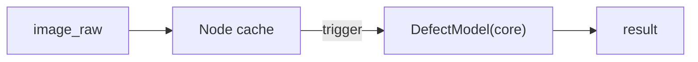

# defect_detector/CLAUDE.md

本文件约束 `defect_detector` 的架构与数据流，目标是：**推理/后处理与 ROS IO 解耦**，并能把结果结构化输出给上层编排/网关。

## 1. 包职责与边界

负责：
- 从工业相机图像做缺陷检测
- 发布结构化缺陷结果（当前为工程骨架）

不负责：
- 相机驱动（`hikvision_driver`）
- 媒体存储与对外下载（网关/媒体模块）

## 2. Public ROS API（当前骨架）

默认命名空间：`/inspection/perception`

订阅：
- `/inspection/hikvision/image_raw` (`sensor_msgs/msg/Image`)

发布：
- `result` (`inspection_interface/msg/DefectInfo`)

服务：
- `detect_defect` (`std_srvs/srv/Trigger`)

## 3. 推荐内部架构（Core 模型可替换）

建议拆成：

1. `DefectModel`
   - OpenCV DNN/TensorRT/ONNXRuntime 的统一接口
2. `Preprocess`
   - resize/normalize/ROI
3. `Postprocess`
   - NMS、bbox/置信度筛选
4. `RosAdapter(Node)`
   - 缓存最新图像
   - service 触发时跑一次推理并发布结果

约束：
- 不要在订阅回调里直接跑推理（会卡图像队列）；用缓存 + 触发/队列

## 4. 数据流

## 5. 文档与 TODO 维护（必须）

- 修改 public ROS API（topic/service/参数）时，必须同步更新：本文件、包内 launch/config、`docs/ARCHITECTURE.md`、仓库根 `TODO.md`
- 新增功能但未实现完：必须把未完成项写入 `TODO.md`（带清晰落点与验收标准）
- 完成 TODO：必须勾选并在提交信息/PR 描述里说明验证方式（真机/仿真/回放）
