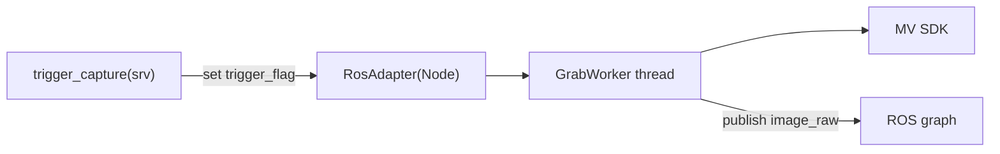

# hikvision_driver/CLAUDE.md

本文件约束 `hikvision_driver` 的分层与数据流，目标是：**MV SDK 调用与 ROS 逻辑解耦**，并保证触发拍照与监控线程可维护。

## 1. 包职责与边界

负责：
- 通过海康 MV SDK 取图
- 发布 `image_raw` + `camera_info`
- 提供 `trigger_capture` 触发服务（触发模式）

不负责：
- 缺陷检测算法（`defect_detector`）
- 媒体落盘/媒体 id（应由网关或独立 capture_manager 管）

## 2. Public ROS API（稳定接口）

默认命名空间：`/inspection/hikvision`

发布：
- `image_raw`（image_transport）
- `camera_info`（image_transport 携带）

服务：
- `trigger_capture` (`std_srvs/srv/Trigger`)

参数（示例，详见 `config/hikvision_driver.yaml`/bringup）：
- `sn` / `device_index`
- `exposure_time` / `gain` / `frame_rate`
- `use_trigger_mode`

## 3. 推荐内部架构（避免所有逻辑堆在 Node）

当前 `HikvisionDriverNode` 已经是 class，但方法很多，建议按职责拆 4 块：

1. `HkSdkSession`（SDK 资源 RAII）
   - create/open/close/destroy handle
   - set params / start/stop grab
2. `GrabWorker`（取图线程）
   - 负责 blocking grab + 像素格式转换
   - 把结果交给 publisher（或通过 lock-free queue）
3. `MonitorWorker`（监控线程）
   - 掉线重连/失败计数/backoff
4. `RosAdapter`（Node）
   - 参数声明与动态参数处理
   - pub/service 创建
   - trigger 回调只设置 flag，不做重 IO

约束：
- 禁止在 ROS service 回调里直接调用一串 MV SDK 阻塞操作（会卡 executor）
- 必须：所有 SDK 句柄生命周期集中管理，避免异常路径泄漏

## 4. 数据流

## 5. 与“结果回显/媒体”对齐的建议

driver 只负责把图像变成 ROS 消息；不要在 driver 内做文件管理。

建议新增（后续实现）：
- `capture_manager`：订阅 `image_raw`，按 task/point_id 落盘并生成 `media_id`
- `inspection_gateway`：通过 `DownloadMedia/ListCaptures` 对外提供访问

## 6. 文档与 TODO 维护（必须）

- 修改 public ROS API（topic/service/参数）时，必须同步更新：本文件、包内 launch/config、`docs/ARCHITECTURE.md`、仓库根 `TODO.md`
- 新增功能但未实现完：必须把未完成项写入 `TODO.md`（带清晰落点与验收标准）
- 完成 TODO：必须勾选并在提交信息/PR 描述里说明验证方式（真机/仿真/回放）
