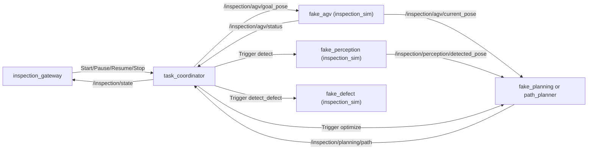

# inspection_sim/CLAUDE.md

本包提供 **无实物（no-hardware）联调环境**：用 fake 节点替代 `agv_driver/arm_driver/pose_detector/defect_detector/path_planner` 的外部依赖，保证 `task_coordinator` 与 `inspection_gateway` 可在纯软件环境下跑通端到端数据流。

## 1. 包职责与边界

负责：
- 提供“接口级仿真”节点（fake drivers），复刻真实包的 Public ROS API
- 提供可重复的时序/延迟/噪声注入（用于实验对比）
- 提供一键启动的仿真 launch（后续实现）

不负责：
- 真实硬件通信（厂商协议只能在 `*_driver` 内）
- 联合优化算法本体（应落在 `path_planner` 的 `PlannerCore`）
- 对外 gRPC（由 `inspection_gateway` 负责）

## 2. Public ROS API（目标接口，必须对齐）

### 2.1 Fake AGV（对齐 `agv_driver`）

namespace：`/inspection/agv`

- 订阅：`goal_pose`、`cmd_vel`（可选）
- 发布：`status`、`current_pose`、`odom`（可选）、TF（可选）
- 服务：`get_nav_map` (`inspection_interface/srv/GetNavMap`)

### 2.2 Fake Arm（对齐 `arm_driver`）

namespace：`/inspection/arm`

- 订阅：`joint_cmd`（可选）
- 发布：`/joint_states`、`status`

默认关节名（Elfin5）：`elfin_joint1..elfin_joint6`

### 2.3 Fake Perception/Planning/Defect（对齐 `task_coordinator` 客户端）

namespace：
- perception：`/inspection/perception`
- planning：`/inspection/planning`

服务（必须提供）：
- `perception/detect` (`std_srvs/srv/Trigger`)
- `planning/optimize` (`std_srvs/srv/Trigger`) + 发布 `planning/path` (`geometry_msgs/msg/PoseArray`)
- `perception/detect_defect` (`std_srvs/srv/Trigger`)

## 3. 推荐内部架构（Node + Core 模型）

目标：避免所有逻辑堆在 Node 回调里，保持可测试与可替换。

建议目录（后续实现按此落地）：

- `inspection_sim/nodes/`
  - `fake_agv_node.py`
  - `fake_arm_node.py`
  - `fake_perception_node.py`
  - `fake_planning_node.py`
  - `fake_defect_node.py`
- `inspection_sim/core/`
  - `agv_kinematics.py`：简单 2D 运动模型 + 到位判定
  - `arm_model.py`：关节状态/到位判定（V1 可为“延时到位”模型）
  - `nav_map_provider.py`：底图/分辨率/origin 的生成与缓存（供 GetNavMap）
- `inspection_sim/domain/`
  - 纯数据结构（不依赖 ROS）

约束：
- Node 只做 ROS IO（pub/sub/srv/timer），不写复杂状态机
- 核心算法（联合优化）不应落在本包；本包只为其提供“可控输入/可控执行环境”

## 4. 数据流（无硬件闭环）

## 5. 与 bringup 的集成约定（后续实现）

目标：在不改上层代码的情况下切换“真机/仿真”。

建议：
- 新增 `inspection_sim/launch/sim_system.launch.py`
  - 启动 fake nodes + `task_coordinator` + `inspection_gateway`
  - 不启动 `agv_driver/arm_driver/hikvision_driver/realsense_driver`（避免冲突）
- 或者给 `inspection_bringup/system.launch.py` 增加 `use_sim:=true` 分支（保持接口不变）

## 6. 文档与 TODO 维护（必须）

- 本仓库根 `TODO.md` 是单一事实来源：仿真相关未完成项必须写进 `TODO.md`
- 若 `inspection_sim` 的对外接口（topic/service/参数）变化，必须同步更新：
  - 本文件 + `README.md`
  - `docs/ARCHITECTURE.md`（ROS 接口章节）
  - `docs/WORKSPACE_OVERVIEW.md`（端到端口径，如受影响）
  - 仓库根 `TODO.md`

