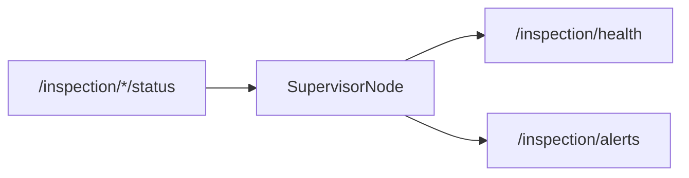

# inspection_supervisor/CLAUDE.md

本包负责系统健康监控（health/alerts）。目标是：**监控逻辑可配置、可扩展**，避免写成一个巨大的 timer if/else。

## 1. 包职责与边界

负责：
- 订阅关键状态（AGV/Arm/SystemState）
- 检测超时未更新、错误码、联锁失败等问题
- 发布健康摘要与告警列表

不负责：
- 控制/规划/执行（只监控不下发动作）

## 2. Public ROS API（建议稳定接口）

命名空间：`/inspection`

发布：
- `/inspection/health`（建议后续换成结构化 msg，而不是 String）
- `/inspection/alerts`（同上）

订阅（建议以 status 为准）：
- `/inspection/agv/status` (`inspection_interface/msg/AgvStatus`)
- `/inspection/arm/status` (`inspection_interface/msg/ArmStatus`)
- `/inspection/state` (`inspection_interface/msg/SystemState`)

## 3. 推荐内部架构

建议把监控规则拆分成 watchers：
- `LivenessWatcher`：检查 topic 最后更新时间（阈值参数化）
- `ErrorCodeWatcher`：解析 `error_code` 并做分级
- `InterlockWatcher`：从 `SystemState` 推断当前是否被联锁卡住

Node 只做：
- 参数声明
- watchers 组装
- timer tick 调用 watchers
- 发布聚合结果

## 4. 数据流

