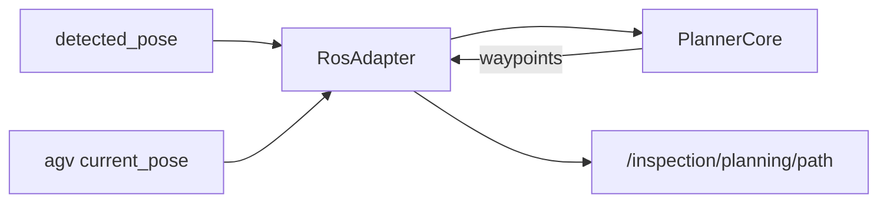

# path_planner/CLAUDE.md

本文件约束 `path_planner` 的架构与数据流，目标是：**规划逻辑可单测、可替换 IK/碰撞模块**，Node 只负责 ROS IO。

## 1. 包职责与边界

负责：
- 输入：工件位姿、当前 AGV 位姿、点位/拍摄约束（未来来自网关）
- 输出：按顺序的站位点（waypoints），用于：
  - UI 路径折线（连接 AGV 站位点）
  - `task_coordinator` 执行

不负责：
- 执行与联锁（`task_coordinator`）
- 硬件控制（drivers/controllers）

## 2. Public ROS API（当前骨架）

默认命名空间：`/inspection/planning`

订阅（当前实现）：
- `/inspection/perception/detected_pose` (`geometry_msgs/msg/PoseStamped`)
- `/inspection/agv/current_pose` (`geometry_msgs/msg/PoseStamped`)

发布：
- `path` (`geometry_msgs/msg/PoseArray`)：站位点序列（工程骨架）

服务：
- `optimize` (`std_srvs/srv/Trigger`)：触发规划（工程骨架）

## 3. 推荐内部架构（PlannerCore + Adapters）

建议拆成：

1. `PlannerCore`（纯算法）
   - 候选站位采样
   - 视角/工作距离约束（来自 `CaptureConfig`）
   - 代价函数与排序/TSP
2. `IKAdapter`
   - 对接 MoveIt/IKFast/TRAC-IK（实现可替换）
3. `CollisionChecker`（可选）
   - 碰撞过滤
4. `RosAdapter(Node)`
   - 订阅输入、缓存状态
   - service 回调仅触发一次规划任务
   - 发布 `PoseArray`（后续替换为更结构化的 msg/srv）

约束：
- 不要把采样/IK/代价评估写在 ROS 回调里

## 4. 数据流（V1）

## 5. 与 inspection-api 对齐的落地方向（后续）

最终对外是 gRPC `PlanInspection -> InspectionPath`。

建议 ROS2 内部增加一个 `PlanInspection.srv`（返回 waypoints+stats），由 `inspection_gateway` 调用；`PoseArray` 仅保留作调试可视化。

