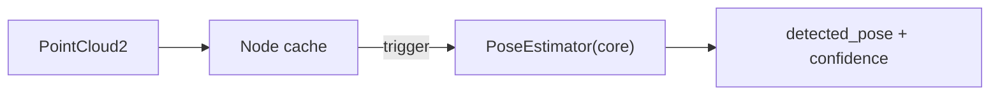

# pose_detector/CLAUDE.md

本文件约束 `pose_detector` 的架构与数据流，目标是：**算法实现独立于 ROS**，Node 只负责订阅/发布与触发调度。

## 1. 包职责与边界

负责：
- 从点云估计工件 6D 位姿（或关键位姿）
- 发布 `detected_pose` + `confidence`

不负责：
- 路径规划（`path_planner`）
- 任务编排（`task_coordinator`）

## 2. Public ROS API（稳定接口）

默认命名空间：`/inspection/perception`

订阅：
- `/inspection/realsense/d435/depth/color/points` (`sensor_msgs/msg/PointCloud2`)

发布：
- `detected_pose` (`geometry_msgs/msg/PoseStamped`)
- `confidence` (`std_msgs/msg/Float32`)

服务：
- `detect` (`std_srvs/srv/Trigger`)：触发一次检测（当前为工程骨架）

## 3. 推荐内部架构（Core + ROS Adapter）

建议新增一个无 ROS 依赖的 core（后续实现时落地）：

- `pose_detector/core/pose_estimator.hpp`
  - `PoseEstimator::estimate(PointCloud, params) -> Pose + confidence`

Node 只做：
- 缓存最新点云
- 在 service/定时器触发时调用 core
- 发布结果

约束：
- 不要在订阅回调里直接跑耗时算法（会卡住消息队列）
- 不要在 Node 里直接写“点云算法细节”，全部下沉到 core

## 4. 数据流

