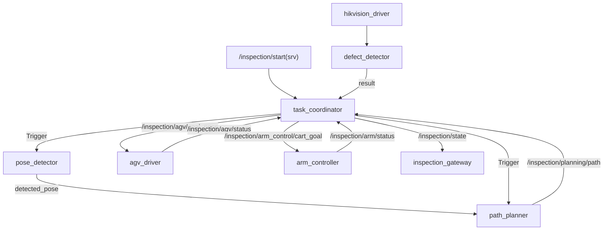

# task_coordinator/CLAUDE.md

本文件约束 `task_coordinator` 的架构与数据流，目标是：**状态机/联锁/执行编排可维护**，避免把整个流程堆在一个巨大 switch + ROS 回调里。

## 1. 包职责与边界

负责：
- 任务状态机（IDLE/LOCALIZING/PLANNING/EXECUTING/PAUSED/...）
- 联锁门控（AGV 到位停止 -> 允许机械臂动作 -> 触发取图/检测）
- 发布系统状态快照 `SystemState`（供网关/HMI 订阅）

不负责：
- 规划算法（`path_planner`）
- 控制算法（drivers/controllers）
- 对外 REST/WS API（`inspection_gateway`）

## 2. Public ROS API（当前实现）

默认命名空间：`/inspection`

发布：
- `state` (`inspection_interface/msg/SystemState`)
- `agv/goal_pose` (`geometry_msgs/msg/PoseStamped`) -> `/inspection/agv/goal_pose`
- `arm_control/cart_goal` (`geometry_msgs/msg/PoseStamped`)
- `arm_control/joint_goal` (`sensor_msgs/msg/JointState`)

订阅：
- `agv/status` (`inspection_interface/msg/AgvStatus`) -> `/inspection/agv/status`
- `arm/status` (`inspection_interface/msg/ArmStatus`) -> `/inspection/arm/status`
- `planning/path` (`geometry_msgs/msg/PoseArray`) -> `/inspection/planning/path`

服务：
- `start` / `stop` / `pause` / `resume` / `get_status`（`inspection_interface/srv/*`）

客户端（当前骨架）：
- `perception/detect`（Trigger）
- `planning/optimize`（Trigger）
- `perception/detect_defect`（Trigger）

## 3. 推荐内部架构（Core + ROS Adapter）

建议尽快把“状态机逻辑”从 Node 里抽走，形成可测试 core：

1. `CoordinatorCore`（无 ROS 依赖）
   - 输入：事件（Start/Pause/Resume/Stop、AGV/Arm 状态、规划结果到达、检测结果到达）
   - 输出：命令（发 AGV goal、发 arm goal、触发相机/检测、状态更新、事件）
2. `InterlockPolicy`
   - 唯一维护联锁规则与提示文案（不要散落 if/else）
3. `RosAdapter(Node)`
   - 把 ROS 回调转成 core 事件
   - 把 core 命令发布到下游 topic 或调用 service
   - 只做 IO glue，不写业务步骤细节

建议机制：
- 用一个内部事件队列（或状态机 tick）解耦：ROS 回调只 push event，核心状态机在 timer 中消费事件推进。

## 4. 数据流（端到端骨架）

```mermaid
flowchart TB
  Start["/inspection/start(srv)"] --> CO["task_coordinator"]
  CO -->|"Trigger"| Pose["pose_detector"]
  Pose -->|detected_pose| PL["path_planner"]
  CO -->|"Trigger"| PL
  PL -->|/inspection/planning/path| CO

  CO -->|/inspection/agv/goal_pose| AGV["agv_driver"]
  AGV -->|/inspection/agv/status| CO

  CO -->|/inspection/arm_control/cart_goal| ARM["arm_controller"]
  ARM -->|/inspection/arm/status| CO

  CAM["hikvision_driver"] --> DET["defect_detector"]
  DET -->|result| CO

  CO -->|/inspection/state| GW["inspection_gateway"]
```

### ⚠ 已知问题

- **step 3 空操作**：`execute_current_waypoint()` step 3 只打日志，未实际发布 `arm_control/cart_goal` 或 `arm_control/joint_goal`，导致 step 4 等待 `_arm_arrived` 永不到达
- **超时未启用**：`_agv_timeout_sec` / `_arm_timeout_sec` / `_detection_timeout_sec` 已声明但从未检查
- **缺陷结果断流**：coordinator 只调 `detect_defect` Trigger 看 bool，不订阅 `defect_detector` 的结果 topic，缺陷详情丢失

## 5. 与 REST/WS API 对齐时的落点（后续）

`task_coordinator` 最终要对齐网关的 `TaskStatus` 模型：
- `SystemState` 字段应能映射出 phase/progress/current_action/error_message + agv/arm 状态 + 当前 waypoint
- 事件流建议新增 `/inspection/events` topic（结构化 capture/defect），网关转为 WebSocket `inspection_event` 推送

## 6. 文档与 TODO 维护（必须）

- 修改 public ROS API（topic/service/参数）或状态机推进规则时，必须同步更新：本文件、`docs/WORKSPACE_OVERVIEW.md`、`docs/ARCHITECTURE.md`、仓库根 `TODO.md`
- 任何“阶段性实现/临时逻辑”必须在 `TODO.md` 留痕（注明什么时候移除、替换为哪个模块）
- 完成 TODO：必须勾选并在提交信息/PR 描述里说明验证方式（真机/仿真/回放）
